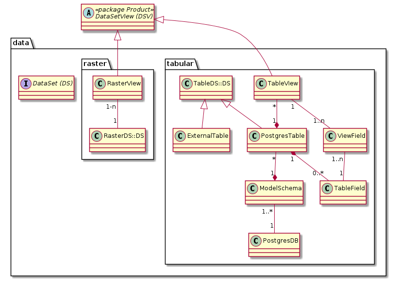
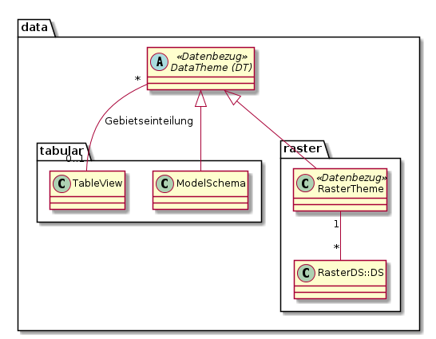

# Data

Stellt die Klassen des Datenkonfigurationsteils dar
* Tabellarische Daten aus Postgres/PostGIS mit und ohne Geometrie
* Rasterdaten aus einem File / einem Katalog
* Rasterlayer aus einem externen WMS

## Übergeordnete Klassen

### Interface DataSet

Bei Vektor- oder tabellarischen Daten entspricht ein Dataset-Eintrag einer (Geo-) Tabelle. 
Bei Rasterdaten entspricht es einem Rasterlayer (Es werden keine nicht georeferenzierten Bilder erfasst).

Bemerkung zur Vererbungs-Strategie: Es ist OK, wenn die DS-Typen (TableDS, RasterDS) nicht in einer physischen
Tabelle "DataSet" zusammengefasst werden.

#### Attributbeschreibung

|Name|Typ|Z|Beschreibung|
|---|---|---|---|
|remarks|String|n|Interne Bemerkungen zum DS.|
|description|String|n|Metainformationen zum DataSet.|

## Klassen in Teilmodell "tabular"

### Klasse TableView

Aus einer Datenbank-Tabelle oder -View abgeleitete "Soft View" mit Filtermöglichkeit sowohl auf die angebotenen
Spalten (via AttributeList) wie auch auf die angebotenen Zeilen (mittels Where-Clause).

#### Attributbeschreibung

|Name|Typ|Z|Beschreibung|
|---|---|---|---|
|whereClause|String(200)|n|Where-Clause zur Einschränkung der Anzahl Zeilen in der TableView.|
|wgcEdit|boolean|j|Gibt an, ob die TableView im Web GIS Client editiert wird. Default: false|
|geoFieldName|String(100)|n|Bei Tabellen mit mehreren Geometriespalten: Name der zu verwendenden Geometrie der TableView.|
|geoType|String(100)|n|Name des Geometrietyps. Null, wenn die Tabelle keine oder mehrere Geometrien umfasst.|
|geoEpsgCode|Integer|n|EPSG-Code des Koordinatensystems. In aller Regel 2056|

### Klasse ViewField

Sortierte Liste der Attribute mit Alias einer TableView.

#### Attributbeschreibung

|Name|Typ|Z|Beschreibung|
|---|---|---|---|
|sort|int|j|Sortierung in WMS Featureinfo und WGC.|
|alias|String(100)|n|Sprechende Bezeichnung des Attributes in WMS und WGC Featureinfo.|
|wmsFiFormat|String(100)|n|Python Formattierungs-String, welcher die Formatierung des Attributes für WMS GetFeatureInfo steuert.|
|displayProps4Json|Json|n|Definiert Alias, Reihenfolge, Wertformatierung für die Properties eines Json-Feldes.|

#### Konstraints

UK über FK's. 

#### Bemerkungen

"wmsFiFormat" und "displayProps4Json" sind nur aktiv, wenn für die Ebene keine separate FeatureInfo-Konfiguration
 erstellt wurde (Teilmodell Featureinfo).
 
### Klasse TableDS

Tabelle einer Datenbank der GDI oder eine externe mit Bezug zur GDI

#### Attributbeschreibung

|Name|Typ|Z|Beschreibung|
|---|---|---|---|
|tableName|String(100)|j|Name der Tabelle oder View in der Datenbank|
|remarks|String|n|Interne Bemerkungen zur Tabelle.|
 
### Klasse ExternalTable

Tabelle einer externen Datenbank, aus welcher die GDI liest oder schreibt (GRETL).

#### Attributbeschreibung

Keine eigenen Attribute.
 
### Klasse PostgresTable

GDI Postgres-Tabelle oder -View.

#### Attributbeschreibung
|Name|Typ|Z|Beschreibung|
|---|---|---|---|
|idFieldName|String(100)|j|Name des Unique-Attributs für QGIS Server u. Desktop. Ist meistens die tid.|
|descriptionModel|String|j|Beschreibung Klasse im INTERLIS-Modell.|
|descriptionOverride|String|n|Übersteuerung der Beschreibung in SIMI (Wird bei "grösserer" Modelländerung in das Modell zurückgeschrieben.|
|catSyncStamp|DateTime|j|Zeitpunkt des letzten Abgleiches mit dem effektiven Schema der Geodatenbank.|
|geoFieldName|String(100)|n|Name des Geometrieattributes. Null, wenn die Tabelle keine oder mehrere Geometrien umfasst.|
|geoType|String(100)|n|Name des Geometrietyps. Null, wenn die Tabelle keine oder mehrere Geometrien umfasst.|
|geoEpsgCode|Integer|n|EPSG-Code des Koordinatensystems. In aller Regel 2056|

### Klasse TableField

Umfasst die Eigenschaften eines Attributs einer PostgresDS. Die Geometriespalten werden nicht beschrieben.

#### Attributbeschreibung

|Name|Typ|Z|Beschreibung|
|---|---|---|---|
|name|String(100)|j|Name des Attributes in Postgres. Maximallänge in Postgres scheint 64 zu sein, darum String(100).|
|typeName|String(100)|j|Name des Datentypes des Attributes.|
|mandatory|boolean|j|Ist der Feldwert zwingend?|
|regExPattern|String(512)|n|RegEx-Pattern. Wird von Dataservice bei Datenänderungen validiert.|
|strLength|Integer|n|Länge des Stringtyps (Sofern die Länge limitiert ist).|
|catSynced|boolean|j|Gibt an, ob das Attribut bei der letzten Katalogabfrage in der Datenbank vorhanden war.|
|descriptionModel|String|j|Beschreibung des Attributs im INTERLIS-Modell.|
|descriptionOverride|String|n|Übersteuerung der Beschreibung in SIMI (Wird bei "grösserer" Modelländerung in das Modell zurückgeschrieben.|

#### Konstraints

UK über "name" und FK zu PostgresTable.   

Bezüglich Auslesen des Kataloges mittels SchemaReader bei bestehenden Attributen: 
* Wenn "name" und "typeName" in Simi und Geodatenbank identisch sind
  * In Simi bestehendes TableField mit den Informationen aus dem Schemareader aktualisieren
* Sonst
  * Neues TableField anlegen, beim alten catSynced auf false setzen.
    
#### Bemerkungen:
* Die Namen der Attribute werden mittels Katalogabfrage aus Postgres gelesen.

### Klasse ModelSchema

Schema, welches mittels INTERLIS-Modell und ili2pg erzeugt wurde. Das Metamodell geht einer Beziehung 
Schema 1 : 0..1 Modell aus. Es kann also maximal ein "Gebrauchsmodell" pro Schema hinterlegt werden.

#### Attributbeschreibung

|Name|Typ|Z|Beschreibung|
|---|---|---|---|
|schemaName|String(100)|j|Name des Schemas.|
|modelName|String(100)|n|Name des INTERLIS-Modelles, mit welchem das Schema angelegt wurde.|

#### Konstraints

UK über schemaName und FK auf PostgresDB.

### Klasse PostgresDB

Postgres-Datenbank, in welcher das Schema (PostgresSchema) enthalten ist. Universell adressiert mittels
* Datenbankname
* Hostname des PG-Clusters
* Port des PG-Clusters

#### Attributbeschreibung

|Name|Typ|Z|Beschreibung|
|---|---|---|---|
|dbName|String(100)|j|Name der Datenbank (auf dem Cluster). Name muss GDI-weit eindeutig sein.|
|defaultValue|Boolean|j|Default-DB in den SIMI-Auswahlfeldern.|

#### Konstraints

UK über dbName.

## Klassen in Teilmodell "raster"

### Klasse RasterView

Enthält die Darstellungsdefinition für ein Raster-DataSet.

#### Attributbeschreibung

Keine eigenen Attribute

### Klasse RasterDS

Enthält die Informationen zu den Rohdaten eines Raster-Datensatzes (Ablagepfad etc.). 
Ausgestaltung abhängig von den Resultaten der Abklärung zur "besten" Raster-Datenhaltung für das AGI.

#### Attributbeschreibung

|Name|Typ|Z|Beschreibung|
|---|---|---|---|
|path|String(200)|j|Filepfad zur verwendeten Rasterebene.|
|remarks|String|n|Interne Bemerkungen zum DS.|
|description|String|n|Metainformationen zum DataSet.|

# Datenumfang für verschiedene Modellarten

Im Minimalszenario weiss SIMI "viel" vom Pub-Modell und -Schema eines Themas, und sehr wenig vom Edit-Modell und -Schema.
Minimalanforderungen bezüglich dem Edit-Modell und Schema:
* Ausgabe, welche Zieltabellen von der Änderung einer Quelltabelle potentiell betroffen sind (Teilmodell Flow "downstream").
* Für die Datenbereitstellung idenfifizieren, welches Edit-Modell zu einer Pub PostgresTable "gehört" (Teilmodell Flow "upstream").

## Eigenschaften Matrix

Die Matrix-Tabelle bildet die Eigenschaften von tabellarischen DS und DSV bei unterschiedlichen Modellarten ab:

|Setting ▶|DB ausserhalb GDI|Edit DB|Stageing|Pub DB|
|---|---|---|---|---|
|Eigenschaft ▼| | | | |
|Schema beschrieben?|Nein|Ja *1|Nein? *2|Ja|
|DS beschrieben?|? *3|Ja? *4|Nein|Ja|
|DS Attribute beschrieben?|Nein|Teilweise *5|Nein|Ja|
|DSV beschrieben?|Nein|Teilweise *6|Nein|Ja|
|DSV hat Attributliste?|Nein|Teilweise *7|Nein|Ja|

### Bemerkungen
* \*1: Ist wahrscheinlich notwendig für den Datenbezug
* \*2: Fraglich, ob diese in der Meta-DB interessieren? Muss dokumentiert werden, dass diese Teil des GRETL-Jobs xy sind?
* \*3: Eher ja, damit wir unsere externen Abhängigkeiten "im Griff" haben.
* \*4: Eher ja, damit wir ein vollständiges Bild unserer Daten haben. Die an einem Job teilnehmenden TableDS sind sicher beschrieben. Nicht beschrieben werden von ili2db generierte Metatabellen, Aufzählungstyp-Tabellen, ...
* \*5, \*6, \*6: Beschrieben, falls die entsprechende Tabelle im API / WGC publiziert ist.

# Konfigurationsbeispiele

## Gewässerschutz Edit

### Klasse ModelSchema

|id|name|model_name|schema_name|raw_url_pattern|raw_url_attributes|
|---|---|---|---|---|---|
|m1|Gewässerschutz (Edit)|PlanerischerGewaesser schutz_LV95_V1_1|afu_gewaesserschutz|https://geo.so.ch/api/rawdata/gws_edit| |

### Klasse PostgresTable

|id|id_modelschema|table_name|
|---|---|---|
|t1|m1|gsbereiche_gsbereiche|
|t2|m1|gwszonen_gwsareal|
|t3|m1|gwszonen_gwszone|
|t4|m1|gwszonen_dokument|

Einträge in PostgresTable "nur" zwecks Referenzierung in Teilmodell "Flow". 

### Klasse TableView

Keine Einträge notwendig, da weder in API noch WGC enthalten.

## Gewässerschutz Publikation

### Klasse ModelSchema

|id|name|model_name|schema_name|raw_url_pattern|raw_url_attributes|
|---|---|---|---|---|---|
|m1|Gewässerschutz|SO_AfU_Gewaesserschutz_ Publikation_20200115|afu_gewaesser schutz_pub|https://geo.so.ch/api/rawdata/gws| |

### Klasse PostgresTable

|id|id_modelschema|table_name|
|---|---|---|
|t1|m1|gewaesserschutz_bereich|
|t2|m1|gewaesserschutz_zone_areal_v|

### Klasse TableView

|id|id_pgtable|default_view|name|whereclause|
|---|---|---|---|---|
|v1|t1|true|||
|v2|t2|false|Zone|typ = 'zone'|
|v3|t2|false|Areal|typ = 'areal'|

## Nutzungsplanung Edit

### Klasse ModelSchema

|id|name|model_name|schema_name|raw_url_pattern|raw_url_attributes|
|---|---|---|---|---|---|
|m1|Nutzungsplanung (Edit)|SO_Nutzungs planung_20171118|arp_npl|https://geo.so.ch/api/rawdata/npl_edit/{0}|\["bfs_gemeindenummer"\]|

Bemerkung: Der Record hat ein FK auf die TableView `agi_hoheitsgrenzen_pub.hoheitsgrenzen_gemeindegrenze [DEFAULT]`, da die
Daten gemeindeweise nachgeführt werden. 

### Klasse PostgresTable

Die für Teilmodell "Flow" relevanten Tabellen sind registriert.

### Klasse TableView

Keine Records, da Edit weder in API noch in WGC vorkommt.

## Nutzungsplanung Publikation

### Klasse ModelSchema

|id|name|model_name|schema_name|raw_url_pattern|raw_url_attributes|
|---|---|---|---|---|---|
|m1|Nutzungsplanung|SO_Nutzungsplanung_ Publikation_20190909|arp_npl_pub|https://geo.so.ch/api/rawdata/npl| |

### Klasse PostgresTable

|id|id_modelschema|table_name|
|---|---|---|
|t1|m1|nutzungsplanung_grundnutzung_v|
|t2|m1|nutzungsplanung_ueberlagernd_flaechenobjekt_v|
|t3|m1|nutzungsplanung_ueberlagernd_linienobjekt_v|
|t4|m1|nutzungsplanung_ueberlagernd_punktobjekt_v|
|t5|m1|nutzungsplanung_erschliessung_flaechenobjekt_v|
|t6|m1|nutzungsplanung_erschliessung_linienobjekt_v|
|t7|m1|nutzungsplanung_erschliessung_punktobjekt_v|

### Klasse TableView

|id|id_pgtable|default_view|name|whereclause|
|---|---|---|---|---|
|v1|t1|true|||
|v2|t1|false|Wald - Grundnutzung|typ = 'wald'|
|v3|t2|false|NaturUndLandschaft - Fläche|typ = 'natur_u_landschaft'|
|v4|t3|false|NaturUndLandschaft - Linie|typ = 'natur_u_landschaft'|
|v5|t4|false|NaturUndLandschaft - Punkt|typ = 'natur_u_landschaft'|

Da umfangreich werden die Tableviews nur für die Grundnutzung und die Relevanten zum Thema "Wald" gelistet.

## Orthofoto 2020

### Klasse RasterTheme

|id|name|raw_url_pattern|raw_url_attributes|
|---|---|---|---|
|r1|Orthofoto 2020|https://geo.so.ch/api/rawdata/orthofoto2020/{0}/{1}|\["x_min","y_min"\]|

Bemerkung: Der Record hat ein FK auf die TableView `agi_kacheln_pub.kachel_1000m [DEFAULT]`, da die
Daten aufgrund ihrer Grösse als 1km * 1km Kacheln angeboten werden.

### Klasse RasterDS

|id|id_rastertheme|pfad|
|---|---|---|
|ds1|r1|rawdata.geo.so.ch\orthofoto2020\geotif.tif|

Bemerkung: Der Pfad wird ausschliesslich für WMS und WGC benötigt. Der statische Bezug der Kacheln erfolgt über 
die im RasterTheme ersichtliche url.

### Klasse RasterView

|id|id_rasterds|default_view|name|
|---|---|---|---|
|rv1|ds1|true| |

## Mapping auf den Inhalt von dataConfig.json (Data-Service)

|cccConfig.json|simi|Bemerkungen|
|---|---|---|
|$schema|globals.data.schemaURI||
|$schema|globals.data.serviceName||
|resources.datasets.name|DataSetView -> DataSetView.identifier||
|resources.datasets.db_url|globals.gdi.dbURI||
|resources.datasets.schema|ModelSchema.schemaName||
|resources.datasets.table_name|TableDS.tableName||
|resources.datasets.primary_key|PostgresTable.idFieldName|$td Es muss hoffentlich nicht ein pk definiert sein, damit es funktioniert...?|
|resources.datasets.fields.name|TableField.name||
|resources.datasets.fields.data_type|TableField.typeName|$td: Sind dies die von postgres zurückgegebenen Datentypen. Wenn Nein über globals.data.typeMap mappen|
|resources.datasets.fields.constraints.maxlength|TableField.stringLength||
|resources.datasets.fields.constraints.pattern|TableField.regExPattern|$td: Wo im AGDI sind diese heute zu pflegen?|
|resources.datasets.geometry.geometry_column|PostgresTable.geo_FieldName||
|resources.datasets.geometry.geometry_type|PostgresTable.geo_Type||
|resources.datasets.geometry.srid|PostgresTable.geo_EpsgCode||

# Ausblick Datenbezug

## Klasse DataTheme

DataTheme ist der enge fachlich-thematische Kontext, über den sich die Struktur des Datenbezuges definiert.

Bemerkung: DataTheme wird besser erst mit Projekt "Datenbezug" in SIMI integriert. Damit keine umfangreichen
Metamodellanpassungen mit SIMI anfallen, ist die Klasse jedoch im Vorprojekt Metamaster schon modelliert.

### Attributbeschreibung

|Name|Typ|Z|Beschreibung|
|---|---|---|---|
|name|String(100)|j|Sprechende Bezeichnung des Themas.|
|remarks|String|n|Interne Bemerkungen zum DT.|

### Gebietseinteilung für Datenbezug

Sofern das DataTheme über eine Gebietseinteilung verfügt, wird dies über die Beziehung DT - TableView und die 
folgenden Attribute dokumentiert und gesteuert:

|Name|Typ|Z|Beschreibung|
|---|---|---|---|
|raw_url_attributes|String(200)|n|Json-Array der Attribute für die URL (Attribut part_url_pattern).|
|raw_url_pattern|String(200)|n|Pattern, welches die Download-URL des DS oder der Teilgebiete bestimmt.|
|raw_display_attributes|String(200)|n|Json-Array der Attribute für die Darstellung des Gebietes (Attribut part_display_pattern).|
|raw_display_pattern|String(200)|n|Pattern, welches den Display-String des DS oder der Teilgebiete.|

Beispiele für die Patterns (Java MessageFormat):
* Vektordatensatz (AV):
    * Foreign Key auf TableView: `agi_hoheitsgrenzen_pub.hoheitsgrenzen_gemeindegrenze [DEFAULT]`
    * raw_url_attributes: `["bfs_gemeindenummer"]`
    * raw_url_pattern: `https://geo.so.ch/api/rawdata/av/{0}`
    * raw_display_attributes: `["gemeindename"]`
    * raw_display_pattern: `AV-Daten der Gemeinde: {0}`
* Oberflächenmodell (LIDAR):
    * Foreign Key auf TableView: `agi_lidar_pub.lidarprodukte_lidarprodukt [DOM]`
    * raw_url_attributes: `["x_min","y_min"]`
    * raw_url_pattern: `https://geo.so.ch/api/rawdata/lidar_dom/{0}/{1}`
    * raw_display_attributes: `["x_min","y_min"]`
    * raw_display_pattern: `Kachel {0} / {1} (X Min / Y Min)`

  
  
 

