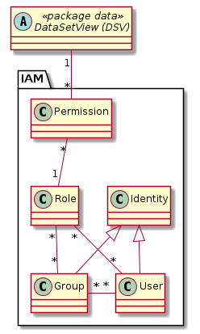

# IAM (Identity and Access Management)

Das IAM ist neu ausschliesslich Datenbezogen. Es gibt keine Anwendungsfälle, welche sich nicht immer
auf die Daten zurückführen liessen. Entsprechend werden die Berechtigungen einzig bezüglich der DataSetView 
gesetzt.

## Modell-Konstraints

Ein Benutzer soll grundsätzlich nicht direkt und indirekt via Gruppe der gleichen Rolle zugewiesen werden. Dies ist
aber eher wichtig, um die Übersicht zu behalten, als dass Missachtung des Konstraints zum nicht Funktionieren der 
GDI führen würde. 

## Klasse Permission

Steuert, ob eine Rolle gegenüber einer Ressource gar keine, nur lesende, oder lesende und schreibende Berechtigung hat.

### Attributbeschreibung

|Name|Typ|Z|Beschreibung|
|---|---|---|---|
|level|enum|j|"read" = 1, "read_write" = 2. Sortierung muss in Datenbank entweder als int's oder als "1_read" etc. vorkommen, damit einfache Permission-Queries geschrieben werden können. SQL: `max(level) |
|priority|int|j|$td config.json anschauen. Priority wird hoffentlich durch Frühlingsrelease obsolet.|

### Konstraints

UK über FK's.

## Klasse Role (PermissionSet)

Bündelt 1-n Permissions gegenüber 1-n  DataSetView.

### Attributbeschreibung

|Name|Typ|Z|Beschreibung|
|---|---|---|---|
|name|String(100)|j|Name der Rolle.|
|remarks|String|n|AGI-Notizen zur Rolle.|

### Konstraints

UK auf "name".

## Klasse Identity

Gruppe oder User. Die Rollenzuweisungen erfolgen auf die Identity.

### Attributbeschreibung

|Name|Typ|Z|Beschreibung|
|---|---|---|---|
|identifier|String(100)|j|Kennung der Identity. Für einen User beispielsweise der Name seines Windows-Account|
|remarks|String|n|AGI-Notizen zur Identity.|

### Konstraints

identifier ist eindeutig innerhalb aller User und der als User publizierten Gruppen. Kann der Einfachheit halber
wahrscheinlich auch "global" eindeutig gesetzt werden.

## Klasse Group

Meist organisatorisch bedingte Gruppe, welche die gleichen Rollen gegenüber der DataSetView hat. 

### Attributbeschreibung

|Name|Typ|Z|Beschreibung|
|---|---|---|---|
|pubAsUser|boolean|j|Gibt an, ob die entsprechende Gruppe zusätzlich als "Benutzer-Vertreter" publiziert wird.|

#### Bemerkung zu pubAsUser
Ist true für Gruppen, welche als Zwillinge der Eigenschaft "Abteilung" des Active-Directory (AD) des AIO erstellt wurden.
Mit der Integration auf das AD können damit "pauschal" GDI-Rechte für alle AD-Benutzer vergeben werden, ohne
dass die Benutzer noch einmal in der Klasse User erfasst werden müssen.

## Klasse User

Benutzer der GDI. Die Identität des Benutzers wird via SES des AIO verifiziert.

Bemerkung: Es bestehen funktionale Einheiten der GDI mit eigenem (redundantem) Benutzerverzeichnis. Bsp: GRETL.

### Attribute

|Name|Typ|Z|Beschreibung|
|---|---|---|---|
|lastname|String(100)|j|Nachname des Benutzers.|
|firstname|String(100)|j|Vorname des Benutzers.|

