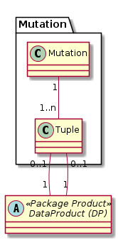

# Mutation

Unterstützt bei einer grösseren Mutation durch Vermittlung der Übersicht, welche DataProduct im Rahmen der Mutation
neu erstellt / gelöscht / aktualisiert / ersetzt werden.

Die Maske wird Unterstützung bieten, um "Deep-Copies" der betroffenen Elemente zu erstellen.
In welchem Umfang die sehr zahlreichen Beziehungen berücksichtigt werden können, wird in der Realisierung entschieden.
 
Damit bezüglich Publikation keine weiteren Felder berücksichtigt werden müssen, wird die Maske das Attribut 
DataComponent.pubScope steuern.

## Klasse Mutation

Beschreibt Zweck, Beginn, Author und Inhalt der Mutation.

### Attributbeschreibung

|Name|Typ|Z|Beschreibung|
|---|---|---|---|
|title|String(100)|j|Kurzer treffender Titel der Mutation.|
|remarks|String|n|Interne Bemerkungen.|

Beginn und Author der Mutation müssen nicht extra gespeichert werden, da über die Metainformationen der Cuba-Platform gelöst:
* Beginn --> createdAt
* Author --> createdBy

## Klasse Tupel

Bildet ein A-B Paar einer von der Mutation betroffenen DataComponent. Die Foreign-Keys auf A und B, abhängig von der 
Art der Mutation

|Mutationsart|FK A|FK B|Beschreibung|
|---|---|---|---|
|Neu-Erstellung| |1|DP kommt im Rahmen der Mutation neu dazu|
|Nur Eigenschaften|2|2|DP wird im Rahmen der Mutation allenfalls verändert --> Beide FK's zeigen auf das gleiche DP.|
|Ersatz durch Kopie|3|4|Bestehendes DP wird im Rahmen der Mutation durch ein neues ersetzt. Das Bestehende wird nach der Mutation gelöscht.|
|Löschung|5| |Bestehendes DP wird im Rahmen der Mutation ohne "1:1 - Ersatz" gelöscht.|

### Attributbeschreibung

|Name|Typ|Z|Beschreibung|
|---|---|---|---|
|initialStateA|(enum)|j|FK auf die Steuerungstabelle. Inhalt ist der State der Steuerungstabelle bei Erstellung der Mutation.|
|remarks|String|n|Interne Bemerkungen.|

### Konstraints

UK über die FK's (Mutation, DP A, DP B)

## Ablauf zur Erstellung einer Mutation

1. Schema auswählen
1. Titel und Bemerkungen definieren
1. Optional: Weiteres Schema wählen, etwa wenn sich die Mutation über Edit und Pub erstreckt und DataProducts der Edit-DB erfasst sind.

Simi ordnet daraufhin alle betroffenem DataProducts als Mutationsart "Unchanged / Update" der Mutation zu.

### GUI-Tabelle der in der Mutation enthaltenen Tupel

|Identifier|Titel|Mutation|A-Stat|B-Stat|Bemerkung|
|---|---|---|---|---|---|
|ch.so.arp.richtplan.map (Map)|Richtplan 2030|Nur Eigenschaften|Publiziert|Publiziert||
|ch.so.arp.richtplan (LG)|Richtplan 2030|Nur Eigenschaften|Publiziert|Publiziert||
|ch.so.arp.richtplan.oev (DSV)|Richtplan 2030 - öV|Löschung|Publiziert| ||
|ch.so.arp.richtplan.miv (DSV)|Richtplan 2030 - MIV|Löschung|Publiziert| ||
|ch.so.arp.richtplan.verkehr (DSV)|Richtplan 2030 - Verkehr|Neu-Erstellung| |Publiziert|Ersetzt ch.so.arp.richtplan.oev / .miv|
|ch.so.arp.richtplan.gewaesser (DSV)|Richtplan 2030 - Gewässer|Ersatz durch Kopie|zu Löschen|Publiziert|Klasse komplett überarbeitet|

