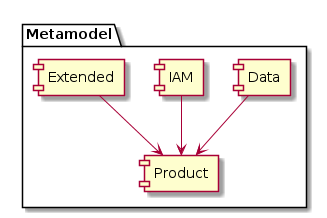

# Packages (Teilmodelle)



* **Product [[Link]](model/product.md):** Enthält die Klassen für die Konfiguration der aus Data abgeleiteten Produkte. 
* **Data [[Link]](model/data.md):** Enthält die Klassen für die Beschreibung der von der GDI genutzten 
Datenquellen (GIS-Tabellen, Raster, ...).
* **IAM [[Link]](model/iam.md):** Klassen zur Konfiguration des Identity und 
Access Management (Benutzer, Gruppen, Rollen, ...).
* **Extended [[Link]](model/extended.md):** Erweiterte Konfiguration zu einem DSV (Featureinfo, Report, Abhängigkeiten, ...).

## Konstraints

Für alle \*:\* Beziehungen in den Teilmodellen ist ein UK über die FK's zu erstellen.

## Erläuterungen zur Kapitelstruktur innerhalb der Teilmodelle

Strukturierung der *.md der Teilmodelle:
 
```
# [Name des Teilmodelles] --Erläuterungen zum ganzen Teilmodell
## Modell-Konstraints -- Falls zutreffend
## Klasse [Klassenname] -- Erläuterungen zu einer Klasse des Teilmodelles
### Attributbeschreibung -- Tabellarische Beschreibung der Attribute
### Konstraints -- Falls zutreffend
```

### Spalten der Attributbeschreibung

* **Name:** Attributname
* **Typ:** Java-Datentyp des Attributes. String wird zusätzlich mit der Länge qualifiziert.
* **Z:** Ist das Attribut **z**wingend erforderlich? (j,n)
* **Beschreibung:** Erläuterungen zum Attribut

Die Attributtabellen sind sortiert gemäss:
1. Zwingende alphabetisch
2. Optionale alphabetisch

## Steuerung der Verfügbarkeit der Daten und Kartenebenen

Die Steuerung betrifft die folgenden Applikationen und Dienste und bezieht sich auf Produkte (= Zusammensetzungen)
und Rohdaten. Das Datenthema = Klassen im Modell wird ebenfalls betrachtet.

|Datenklasse \><br>Apps und Dienste|DataSetView|Singleactor|LayerList|Map|
|---|---|---|---|---|
|Featureservice (WFS u. DataService)|x|-|-|-|
|Bulkservice|x (1.)|-|-|-|
|WMS (2)|-|x|x|-|
|WGC|-|x|x|x (3.)|
|SO-Locator|-|x|x|x (4.)|

Todo: 
* Ergänzen mit Spalte Map
* Ergänzem mit Zeile WGC und SO-Locator

Bemerkungen:
1. Die Berechtigung für den Bulk-Service leitet sich aus der Summe der Berechtigungen der enthaltenen DataSetView ab.   
Ein xtf kann auch abgegeben werden, sofern eine geschützte Spalte nullable ist --> wird in xtf auf null gesetzt.   
Umsetzung davon muss in Konzeptphase zu Datenbezug gelöst werden. 
2. Verhalten bei der Kombination der Flags für SingleActor (SA) und LayerList (LL)?
    * SA:X LL:X --> SA ist sowohl alleine stehend wie auch in der LL Gruppe adressierbar. Ist dies je gewünscht oder   
    eigentlich ein Konfigurationsfehler?
    * SA:X LL:- --> SA ist nur alleine stehend adressierbar. Gleich wie wenn der SA in gar keiner Gruppe enthalten ist.
    * SA:- LL:X --> SA ist nur via LL Gruppe adressierbar.
3. Background Map's als WMTS eher statisch eingebunden --> Mittels json templating gelöst.   
Foreground Maps werden dynamisch mittels sql2json in das themes.json geschrieben.   
Wie ist er Zusammenhang beim Drucken aus dem WGC zum WMS der Background-Maps?
4. Background Map's werden als "direct-connect" geladen. Foreground maps stehen nicht zur Verfügung.

### Resultierende Steuerungselemente

#### Ebenenpublikation in DataProduct

|Auswahl-Zeile in Dropdown|SingleActor oder LayerList|Map|
|---|---|---|
|1: WMS, WGC u. QGIS|xx|-|
|2: Nur WMS|x|-|
|3: Nicht publiziert|x|-|
|4: Zu Löschen|x|-|
|A: WGC u. QGIS|-|xx|
|B: Nicht publiziert|-|x|
|C: Zu Löschen|-|x|

xx = Default   
Die folgenden Status von SingleActor oder LayerList (SAL), Map sind identisch, und sollen nur einmal vorkommen:
* SAL:3 == MAP:B
* SAL:4 == MAP:C

**Umsetzung**

Ausmodellieren in die Steuerungstabelle DataProduct_PubScope mit den folgenden Attributen:

|Name|Typ|Z|Beschreibung|
|---|---|---|---|
|displayText|String(100)|j|Anzeige-Text in SIMI (Beispielsweise `1: WMS, WGC u. QGIS`, Siehe oben)|
|overallState|enum|j|"published", "not self published", "to be deleted"|
|default|Boolean|j|Defaultwert - Kann auch wegfallen, wenn für die korrekte Anzeige des Default-Wertes nicht notwendig|
|forDSV|Boolean|j|Wert auf DataSetView anwendbar?|
|forGroup|Boolean|j|Wert auf SingleActor, FacadeLayer, ExtWMS anwendbar?|
|forMap|Boolean|j|Wert auf Map anwendbar?|
|pubToWMS|Boolean|j|Wird das DataProduct im WMS publiziert?|
|pubToWGC|Boolean|j|Wird das DataProduct im Web GIS Client publiziert?|
|pubToLocator|Boolean|j|Wird das DataProduct im SO-Locator in QGIS Desktop publiziert?|
|sort|Integer|j|Sortierung der Werte in SIMI.|

Inhalt der Steuerungstabelle

|displayText|overallState|forDSV|forGroup|forMap|pubToWMS|pubToWGC|pubToLocator|sort|
|---|---|---|---|---|---|---|---|---|
|WGC, QGIS u. WMS|published|x|x|-|x|x|x|1|
|Nur WMS|published|x|x|-|x|-|-|10|
|WGC u. QGIS|published|-|-|x|-|x|x|20|
|Nicht (selbst) publiziert|not self published|x|x|x|-|-|-|30|
|Zu Löschen|to be deleted|x|x|x|-|-|-|40|

Der Default ist jeweils die erste zutreffende Zeile der Steuerungstabelle (Nach Sortierung).

#### Publikation der Rohdaten

Siehe Attribut data.DataSetView.rawDownload

#### Snipplet für Tabellenerstellung

```markdown
|Name|Typ|Z|Beschreibung|
|---|---|---|---|
```

#### Stringlängen anschaulich

|Länge|Beispiel|
|---|---|
|String(100)|Lorem ipsum dolor sit amet, consetetur sadipscing elitr, sed diam nonumy eirmod tempor invidunt ut l|
|String(200)|Lorem ipsum dolor sit amet, consetetur sadipscing elitr, sed diam nonumy eirmod tempor invidunt ut labore et dolore magna aliquyam erat, sed diam voluptua. At vero eos et accusam et justo duo dolores |
|String(1000)|Lorem ipsum dolor sit amet, consetetur sadipscing elitr, sed diam nonumy eirmod tempor invidunt ut labore et dolore magna aliquyam erat, sed diam voluptua. At vero eos et accusam et justo duo dolores et ea rebum. Stet clita kasd gubergren, no sea takimata sanctus est Lorem ipsum dolor sit amet. Lorem ipsum dolor sit amet, consetetur sadipscing elitr, sed diam nonumy eirmod tempor invidunt ut labore et dolore magna aliquyam erat, sed diam voluptua. At vero eos et accusam et justo duo dolores et ea rebum. Stet clita kasd gubergren, no sea takimata sanctus est Lorem ipsum dolor sit amet. Lorem ipsum dolor sit amet, consetetur sadipscing elitr, sed diam nonumy eirmod tempor invidunt ut labore et dolore magna aliquyam erat, sed diam voluptua. At vero eos et accusam et justo duo dolores et ea rebum. Stet clita kasd gubergren, no sea takimata sanctus est Lorem ipsum dolor sit amet. Duis autem vel eum iriure dolor in hendrerit in vulputate velit esse molestie consequat, vel illum dolore eu f|

# Beziehung zu configXY.json

Mittels Simi werden auch die Konfigurationsdateien für API und WGC erzeugt. Sofern in der Metadatenbank keine Informationen
zu den zu konfigurierenden Metaobjekten enthalten sind, kann die Konfiguration komplett ausserhalb SIMI, oder über das
Teilmodell globals erfolgen. Für die betroffenen configXY.json ist in der Spalte Teilmodell jeweils "globals" eingetragen.

|Konfig-Datei|Simi-Teilmodell|Bemerkungen|
|---|---|---|
|agdiConfig.json|globals.gdi.*|Viele der Eigenschaften werden in die Pipeline wandern.|
|cccConfig.json|ccc|
|dataConfig|data||
|documentConfig.json|globals|Wo sind die Referenzen auf die datasets abgebildet? Diese sollten sich mittels bouncer abbilden lassen||
|elevationConfig.json|globals.elevation.*||
|featureInfoConfig.json|FeatureInfo||
|landregConfig.json|globals.landreg.*|Nachteil bei Lösung über globals: Know your GDI ist schwieriger zu lösen. Ist dies nicht sowieso ein eigenes qml? $td|
|mapViewerConfig.json|product||
|permission.json|?|$td|
|printConfig.json|globals.wgcPrint.*||


