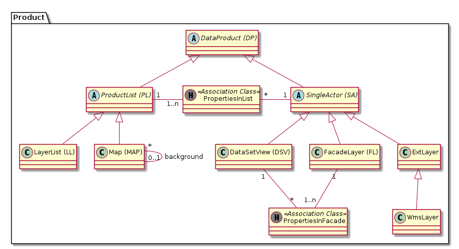

# Product

Bildet alle möglichen Arten von Kartenebenen und deren Beziehung untereinander ab.

## Klasse DataProduct (DP)

Basisklasse aller Datenprodukte.

Beispiel tabellarische Daten: Wenn ein DataProduct genau eine Tabelle umfasst ist es ein Objekt
der Subklasse DataSetView, wenn es mehrere Tabellen umfasst ein Objekt der Subklasse Productset respektive FacadeLayer.

Der Dateninhalt von externen Diensten wird nach Bedarf ebenfalls als DataProduct geführt.
Beispiele:
* WMS-Ebene eines Nachbarkantones, welcher in eine vorkonfigurierte Karte des Kantons Solothurn aufgenommen wird.
* WMS-Ebene der Fachapplikation Altlast4Web welche in eine thematische Karte des Web GIS Clients eingebunden werden soll.

### Attributbeschreibung

|Name|Typ|Z|Beschreibung|
|---|---|---|---|
|identifier|String(100)|j|Eindeutiger hierarchischer Identifier des DataProduct (ch.so.fuu.bar).|
|pubScope|enum|j|Gibt an, in welchen Diensten und Applikationen das DP publiziert ist. Details siehe [hier](./README.md#ebenenpublikation-in-dataproduct).|
|keywords|String(200)|n|Stichworte für das DataProduct. Können auch thematische Überbegriffe sein.|
|remarks|String|n|Interne Bemerkungen.|
|synonyms|String(200)|n|Synonyme für das DataProduct.|
|title|String(200)|n|Angezeigter Titel (Bezeichnung) des Dataproduct. Falls null in Erstellungsphase wird identifier verwendet.|
|releasedAt|DateTime|n|Zeitpunkt der aktuellsten Freigabe.|
|releasedThrough|String(100)|n|Name und Vorname des Benutzers, welcher die Freigabe vorgenommen hat.|
|abGeneration|enum|n|"A" oder "B". Generation innerhalb der AB-Mutation.|
|abPublished|Boolean|n|Gibt an, ob das DP zur gegenwärtig publizierten Generation gehört oder nicht.|

### Konstraints

Feld "identifier" ist GDI-weit eindeutig.

## Strukt "ChildLayerProperties"

Die Attribute der Strukt definieren die Reihenfolge und überschriebene Eigenschaften (Bsp. Transparenz) einer Ebene innerhalb 
der übergeordneten Gruppe von Ebenen.

#### Attributbeschreibung

|Name|Typ|Z|Beschreibung|
|---|---|---|---|
|sort|int|j|Sortierindex der Ebene innerhalb der ProductList.|
|transparency|int|j|Transparenz der Ebene in Prozent. Default: 0 (nicht transparent).|

## Rund um Klasse "ProductList"

### Klasse ProductList

Sortierte Liste von Einzellayern (=SingleActor), welche im Web GIS Client „explodiert“ dargestellt wird.

Beispiele: 
* Sortierte Liste von Einzeldatensatzdarstellungen (=DataSet), die gemeinsam als Kinder eines WMS "Parent-Layer" dargestellt wirden.
* Sortierte Liste von SA's für eine Map

#### Attributbeschreibung

ProductList hat keine weiteren eigene Attribute.

### Klasse Map

Die enthaltenen SingleActor können aus beliebigen thematischen Kontexten zusammengesetzt sein.

Da eine Map häufig aus 1-n LayerList's zusammengesetzt wird: Im GUI wird eine Hilfsfunktion implementiert, 
mit welcher in der Karte noch nicht vorhandene SA's einer LG beigefügt werden können.

#### Attributbeschreibung

|Name|Typ|Z|Beschreibung|
|---|---|---|---|
|background|boolean|j|Gibt an, ob es sich um eine Hintergrundkarte handelt oder nicht.|
|wgcUrlValue|String(50)|j|Kürzel der Karte im Aufruf des WGC.|

#### Konstraints

wgcUrlValue ist unique.

### Klasse LayerGroup (LG)

Die enthaltenen SingleActor haben einen engen thematischen Kontext.

#### Attributbeschreibung

LL hat keine weiteren eigene Attribute.

### Klasse PropertiesInList

Attributierte Verknüpfungstabelle der m:n Beziehung zwischen FL und DSV.

Attribute siehe Strukt "ChildLayerProperties"

## Rund um Klasse SingleActor

### Klasse SingleActor (SA)

Einzelebene oder FacadeLayer. Verhält sich in den Clients immer wie eine einzelne Ebene. Die Kindebenen eines FacadeLayer
erscheinen beispielsweise nicht als WMS-Ebene und werden in der TOC des Web GIS Client nicht angezeigt.

#### Attributbeschreibung

SA hat keine weiteren eigene Attribute.

### Klasse FacadeLayer (FL)

Aggregationslayer, welcher von den Applikationen als ein Layer angesprochen wird.

Layereigenschaften wie Sichtbarkeit und Transparenz wirken sich nur auf den FacadeLayer als ganzes aus und nicht 
individuell auf die im Facadelayer enthaltenen Unterlayer. Die enthaltenen Unterlayer sind im TOC nicht sichtbar.

Beispiel: Plan für das Grundbuch.

#### Attributbeschreibung

FL hat keine weiteren eigene Attribute.

#### Bemerkungen

Die Anforderungen an das Modell bewirken, dass LayerList und Facadelayer neu im Modell "weit entfernt" sind.
Die Umwandlung von FL zu LL oder umgekehrt erfordert also etwas Handarbeit.

### Klasse DataSetView

Direkt aus einem Dataset abgeleitetes Produkt, welches Eigenschaften 
(Darstellung / Attribute) eines Dataset auf den entsprechenden Einsatzzweck anpasst.

Keine Rendering-Information hat ein DSV vom Typ "externe WMS Ebene". Bei internen Raster- und Tabellarischen
Daten ist das Styling als QML optional enthalten.

#### Attributbeschreibung

|Name|Typ|Z|Beschreibung|
|---|---|---|---|
|defaultView|boolean|j|Für ca. 3/4 der DS gibt es "nur" die Default-View. Default: true.|
|rawDownload|boolean|j|Gibt an, ob die Daten in der Form von AtOS, DataService, WFS bezogen werden können. Default: Ja|
|name|String(100)|n|Interne Bezeichnung der DataSetView, um diese von weiteren DSV's des gleichen DS unterscheiden zu können. Wird nur manuell gesetzt falls defaultView=false.|
|remarks|String|n|Interne Bemerkungen zur DSV.|
|styleServer|String (XML)|n|QML-Datei, welche das Styling der Ebene in QGIS-Server bestimmt.|
|styleDesktop|String (XML)|n|QML-Datei, welche das Styling der Ebene in QGIS-Desktop bestimmt. Falls null und style_server <> null wird style_server verwendet.|
|searchType|enum|j|Gibt an, ob und wie die DSV durchsuchbar ist (Nein, immer, falls geladen). Default Nein|
|searchFacet|String(100)|n|Facet-Key. Falls null wird der identifier verwendet|
|searchFilterWord|String(100)|(n)|Schlüsselwort, mit welchem die Sucheingabe auf die Objekte dieser DSV eingeschränkt wird. Zwingend, wenn die Suche aktiviert ist.|

Bemerkungen zu der Default-View (defaultView=true):
* SIMI setzt [name] auf NULL. Die defaultView hat den gleichen Identifier wie das DataSet. 
* SIMI verhindert das Setzen einer WhereClause (Klasse TableView).
* In der Regel umfasst die DefaultView alle Attribute des DS. Mögliche Ausnahme: Klasse mit zugriffsgeschütztem Attribut. 

#### Konstraints

UK auf den FK zur DataSetView.   
styleServer und styleDesktop: QML in korrekter Version hochgeladen?

### Klasse PropertiesInFacade

Attributierte Verknüpfungstabelle der m:n Beziehung zwischen FL und DSV.

Attribute siehe Strukt "ChildLayerProperties"

#### Konstraints

UK über die FK's.

### Klasse ExtLayer

Externe Ebene, welche analog zu den internen Ebenen gesucht und in WGC und QGIS-Desktop geladen werden kann.
Laden in QGIS-Desktop mittels SO-Locator. 

Definition "Extern": Die Rohdaten der Ebene sind nicht als DataProduct erfasst. Gründe für nicht erfasste Rohdaten:
* Stammt aus Dienst eines Servers ausserhalb des Kantons Solothurn.
* Stammt aus Dienst einer Fachapplikation. 

#### Attributbeschreibung

Keine eigenen Attribute

### Klasse WmsLayer

Externe WMS-Ebene.

#### Attributbeschreibung

|Name|Typ|Z|Beschreibung|
|---|---|---|---|
|capabilitiesUrl|String(200)|j|URL für die "GetCapabilities" Abfrage des externen WMS.|
|layerList|String(1000)|j|Json-Array der Identifier der abzufragenden externen WMS-Layer.|

#### Konstraints

UK über wmsURL und identifier. 

### Klasse WmtsLayer

Als Ebene eingebundener externer WMTS.

#### Attributbeschreibung

|Name|Typ|Z|Beschreibung|
|---|---|---|---|
|capabilitiesUrl|String(200)|j|URL für die "GetCapabilities" Abfrage des externen WMTS.|

#### Konstraints

UK über wmsURL und identifier. 

## Klasse ProperitesInList

Attributierte Verknüpfungstabelle der m:n Beziehung zwischen PL und SA.

### Attributbeschreibung

|Name|Typ|Z|Beschreibung|
|---|---|---|---|
|sort|int|j|Sortierindex der Ebene innerhalb der ProductList.|
|transparency|int|j|Transparenz der Ebene in Prozent. Default: 0 (nicht transparent).|
|visible|boolean|j|Ist die Ebene in der ProductList per default sichtbar oder nicht? Default: Ja.|

### Konstraints

UK über die FK's.

# Beispiele

## Zusammenfassen von Geometrietypen in Facadelayer

Beipielsweise in der Archäologie werden kleine Denkmäler als Punktgeometrie, grosse als Polygon geführt.

### DataSetView

|id|identifier|in_wms|in_wgc|
|---|---|---|---|
|s1|ch.so.ada.denkmal.punkt|false|false|
|s1|ch.so.ada.denkmal.polygon|false|false|

### FacadeLayer

|id|identifier|in_wms|in_wgc|
|---|---|---|---|
|f1|ch.so.ada.denkmal|true|true|

### PropertiesInFacade

|id_facadelayer|id_datasetview|sort|
|---|---|---|
|f1|s1|10|
|f1|s2|5|

Keine Einträge in LayerList und PropertiesInList.

## Layergruppe (Productlist)

Zusammenfassung von Haltestellen und Netz zu Layergruppe öV.

### SingleActor

|id|identifier|in_wms|in_wgc|
|---|---|---|---|
|s1|ch.so.avt.oev.haltestellen|true|true|
|s2|ch.so.avt.oev.netz|false|false|

### LayerList

|id|identifier|in_wms|in_wgc|
|---|---|---|---|
|l1|ch.so.avt.oev|true|true|

### PropertiesInList

|id_productlist|id_singleactor|sort|
|---|---|---|
|l1|s1|10|
|l1|s2|5|

## Layergruppe mit externem WMS

Gruppierung des KBS mit dem KBS-WMS von Geodienste.ch

### DataSetView

|id|identifier|in_wms|in_wgc|
|---|---|---|---|
|s1|ch.so.afu.kbs|true|true|

### ExtWmsLayer

|id|identifier|wms_url|in_wgc|
|---|---|---|---|
|w1|ch.kkgeo.kbs|https://geodienste.ch/db/kataster_belasteter_standorte_v1_4_0/deu?SERVICE=WMS&REQUEST=GetMap&LAYERS=kbs|true|

### LayerList

|id|identifier|in_wms|in_wgc|
|---|---|---|---|
|l1|ch.kbs|true|true|

### PropertiesInList

|id_productlist|id_singleactor|sort|
|---|---|---|
|l1|s1|10|
|l1|w1|5|

## Mapping auf den Inhalt von mapViewerConfig.json

Aufgrund der enthaltenen Informationen empfielt es sich, die variablen Informationen in ein Rumpf-Json hineinzugenerieren.
Variabel sind einzig die angebotenen Karten (und die darin enthaltenen Ebenen). 

Konstanter Präfix im mapViewerConfig.json ist folglich immer **resources.qwc2_themes.themes.items**

|cccConfig.json|simi|Bemerkungen|
|---|---|---|
|id|Map.identifier||
|name|Map.identifier||
|title|Map.title||
|wms_name|globals.wms.name||
|url|globals.wms.url|Scheint nur der Pfad-Teil der URL zu sein|
|attribution.title|globals.wgc.*||
|attribution.OnlineResource|globals.wgc.*||
|keywords|globals.wgc.*||
|mapCrs|globals.wgc.crs|Beispielwert für EPSG-Code 2056: "EPSG:2056"|
|bbox|globals.wgc.bbox|Kann heute im AGDI konfiguriert werden|
|initialBbox|globals.wgc.bbox|Kann heute im AGDI konfiguriert werden|
|---|---|---|
|**DataSetView...**|||
|sublayers.name|Dataproduct.identifier||
|sublayers.title|Dataproduct.title||
|sublayers.visibility|PropertiesInList.visible||
|sublayers.queryable|globals.wgc.*||
|sublayers.opacity|PropertiesInList.transparency||
|sublayers.bbox|globals.wgc.bbox||
|expanded|Wert immer = "true"||
|drawingOrder|PropertiesInList.sort||
|backgroundLayers|globals.wgc.backgroundLayers||
|print|globals.wgc.print||
|printLabelConfig|globals.wgc.printLabelConfig||
|searchProviders[0]|globals.wgc.searchCoordinates||
|searchProviders[1]|?|Für den Karteninhalt relevante Suchen? (= globale und spezifische Suchen)|
|editConfig|SingleActor.wgcEdit|Konfiguration für das Editieren im WGC. Wird in Config für jede Map wiederholt...?|
|---|---|---|
|**FacadeLayer...**|||
|Beispiele fehlen in aktueller Konfiguration...|||

