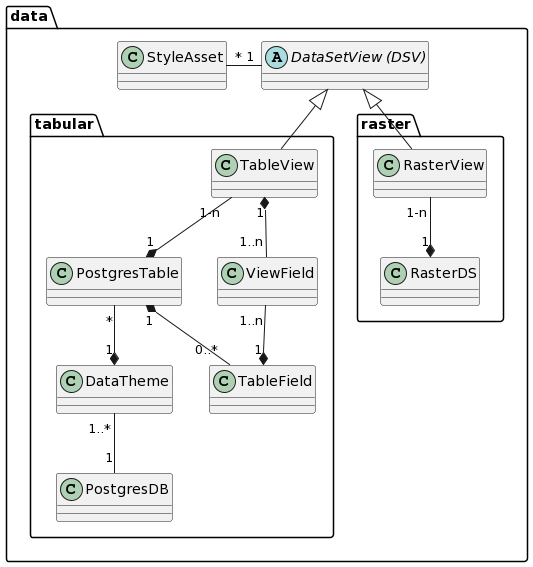

# Data

Stellt die Klassen des Datenkonfigurationsteils dar
* Tabellarische Daten aus Postgres/PostGIS mit und ohne Geometrie
* Rasterdaten aus einem File / einem Katalog
* Rasterlayer aus einem externen WMS

## Übergeordnete Klassen

### Klasse DataSetView (DSV)

Direkt aus einem Dataset abgeleitete View, welche Eigenschaften 
eines Dataset (Darstellung / Attribute / Zeilenumfang) auf den entsprechenden Einsatzzweck anpasst.

Keine Rendering-Information hat ein DSV vom Typ "externe WMS Ebene". Bei internen Raster- und Tabellarischen
Daten ist das Styling als QML optional enthalten.

Bemerkung: Im DB-Schema ist die DSV im Moment noch mit Präfix "simiproduct_" enthalten. $td

#### Attributbeschreibung

|Name|Typ|Z|Beschreibung|
|---|---|---|---|
|rawDownload|boolean|j|Gibt an, ob die Daten in der Form von AtOS, DataService, WFS bezogen werden können. Default: Ja|
|isFileDownloadDSV|boolean|j|Ist das DSV der "Konfigurationsträger" für den Datenbezug?. Default: False|
|styleServer|String (XML)|n|QML-Datei, welche das Styling der Ebene in QGIS-Server bestimmt.|
|styleServerChanged|DateTime|n|Zeitpunkt der letzten syleServer änderung.|
|styleDesktop|String (XML)|n|QML-Datei, welche das Styling der Ebene in QGIS-Desktop bestimmt. Falls null und style_server <> null wird style_server verwendet.|
|styleDesktopChanged|DateTime|n|Zeitpunkt der letzten syleDesktop änderung.|

#### Konstraints

UK auf den FK zur DataSetView.   
styleServer und styleDesktop: QML in korrekter Version hochgeladen?

### Klasse StyleAsset

Speichert die von einem QML referenzierten Dateien (Icons, SVG's) beim upload der Darstellung
als zip.

#### Attributbeschreibung

|Name|Typ|Z|Beschreibung|
|---|---|---|---|
|fileContent|byte[]|j|Dateiinhalt des Assets|
|fileName|String(255)|j|Dateiname des Assets|
|isForServer|Boolean|j|Gibt an, ob es sich um ein Asset für die Server- oder die QGIS-Desktop Darstellung handelt.|

### Interface DataSet (DS)

Bei Vektor- oder tabellarischen Daten entspricht ein Dataset-Eintrag einer (Geo-) Tabelle. 
Bei Rasterdaten entspricht es einem Rasterlayer (Es werden keine nicht georeferenzierten Bilder erfasst).

Bemerkung zur Vererbungs-Strategie: Es ist OK, wenn die DS-Typen (TableDS, RasterDS) nicht in einer physischen
Tabelle "DataSet" zusammengefasst werden.

#### Attributbeschreibung

|Name|Typ|Z|Beschreibung|
|---|---|---|---|
|remarks|String|n|Interne Bemerkungen zum DS.|
|description|String|n|Metainformationen zum DataSet.|

## Klassen in Teilmodell "tabular"

### Klasse TableView

Auf einer Datenbank-Tabelle basierende "Soft View" mit Filtermöglichkeit sowohl auf die angebotenen
Spalten (via AttributeList) wie auch auf die angebotenen Zeilen (mittels Filter DB-View).

#### Attributbeschreibung

|Name|Typ|Z|Beschreibung|
|---|---|---|---|
|rowFilterViewName|Sting(100)|n|Name der Db-View, über welche ein Subset der Records der Tabelle selektiert wird. Die View verändert weder Umfang noch Datentyp der Tabellenspalten.|
|wgcEdit|boolean|j|Gibt an, ob die TableView im Web GIS Client editiert wird. Default: false|
|searchType|enum|j|Gibt an, ob und wie die DSV durchsuchbar ist (Nein, immer, falls geladen). Default Nein|
|searchFacet|String(100)|n|Facet-Key. Falls null wird der identifier verwendet|
|searchFilterWord|String(100)|(n)|Schlüsselwort, mit welchem die Sucheingabe auf die Objekte dieser DSV eingeschränkt wird. Zwingend, wenn die Suche aktiviert ist.|

Siehe "TableView_SearchTypeEnum.java" bezüglich der in der Datenbank codierten searchType-Enumerationen. 

### Klasse ViewField

Sortierte Liste der Attribute mit Alias einer TableView.

#### Attributbeschreibung

|Name|Typ|Z|Beschreibung|
|---|---|---|---|
|sort|int|j|Sortierung in WMS Featureinfo und WGC.|
|serviceExposed|boolean|j|Gibt an, ob ein Attribut in den Diensten (DataService, WMS, ..) oder sichtbar ist, oder nur im Datenbezug.|

#### Konstraints

UK über FK's. 

#### Bemerkungen

"wmsFiFormat" und "displayProps4Json" sind nur aktiv, wenn für die Ebene keine separate FeatureInfo-Konfiguration
 erstellt wurde (Teilmodell Featureinfo).
 
### Klasse PostgresTable

GDI Postgres-Tabelle.

#### Attributbeschreibung
|Name|Typ|Z|Beschreibung|
|---|---|---|---|
|tableName|String(100)|j|Name der Tabelle in der Datenbank|
|tableIsView|Boolean|j|True, falls die Quelle eine DB-View ist (meist false). Wird aufgrund der Antwort des Schemareader gesetzt.|
|idFieldName|String(100)|j|Name des Unique-Attributs für QGIS Server u. Desktop. Ist meistens die tid.|
|title|String(100)|n|Titel der Tabelle (Alias)|
|descriptionModel|String|n|Beschreibung Klasse im INTERLIS-Modell.|
|descriptionOverride|String|n|Überschreibung der Klassenbeschreibung.|
|catSyncStamp|DateTime|j|Zeitpunkt des letzten Abgleiches mit dem effektiven Schema der Geodatenbank.|
|geoFieldName|String(100)|n|Name des Geometrieattributes. Null, wenn die Tabelle keine oder mehrere Geometrien umfasst.|
|geoType|String(100)|n|Name des Geometrietyps. Null, wenn die Tabelle keine oder mehrere Geometrien umfasst.|
|geoEpsgCode|Integer|n|EPSG-Code des Koordinatensystems. In aller Regel 2056|
|remarks|String|n|Interne Bemerkungen zur Tabelle.|

### Klasse TableField

Umfasst die Eigenschaften eines Attributs einer PostgresDS. Die Geometriespalten werden nicht beschrieben.

#### Attributbeschreibung

|Name|Typ|Z|Beschreibung|
|---|---|---|---|
|name|String(100)|j|Name des Attributes in Postgres. Maximallänge in Postgres scheint 64 zu sein, darum String(100).|
|alias|String(100)|n|Sprechende Bezeichnung des Attributes in WMS und WGC Featureinfo.|
|typeName|String(100)|j|Name des Datentypes des Attributes.|
|mandatory|boolean|j|Ist der Feldwert zwingend?|
|strLength|Integer|n|Länge des Stringtyps (Sofern die Länge limitiert ist).|
|catSynced|boolean|j|Gibt an, ob das Attribut bei der letzten Katalogabfrage in der Datenbank vorhanden war.|
|descriptionModel|String|j|Beschreibung des Attributs im INTERLIS-Modell.|
|descriptionOverride|String|n|Übersteuerung der Beschreibung in SIMI (Wird bei "grösserer" Modelländerung in das Modell zurückgeschrieben.|
|wmsFiFormat|String(100)|n|Python Formatierungs-String, welcher die Formatierung des Attributes für WMS GetFeatureInfo steuert.|
|displayProps4Json|Json|n|Definiert Alias, Reihenfolge, Wertformatierung für die Properties eines Json-Feldes.|

#### Konstraints

UK über "name" und FK zu PostgresTable.   

Bezüglich Auslesen des Kataloges mittels SchemaReader bei bestehenden Attributen: 
* Wenn "name" und "typeName" in Simi und Geodatenbank identisch sind
  * In Simi bestehendes TableField mit den Informationen aus dem Schemareader aktualisieren
* Sonst
  * Neues TableField anlegen, beim alten catSynced auf false setzen.
    
#### Bemerkungen:
* Die Namen der Attribute werden mittels Katalogabfrage aus Postgres gelesen.

### Klasse DbSchema

Schema, welches 1-n (Geo-)Tabellen eines Themas umfasst. Mittels INTERLIS-Modell
und ili2pg erzeugt. 

Ausblick INTERLIS-Modell: Das Metamodell geht von einer Beziehung 
Schema 1 : 0..1 Modell aus. Es kann also maximal ein "Gebrauchsmodell" pro Datenthema hinterlegt werden.

#### Attributbeschreibung

|Name|Typ|Z|Beschreibung|
|---|---|---|---|
|schemaName|String(100)|j|Name des Schemas.|

#### Konstraints

UK über schemaName und FK auf PostgresDB.

### Klasse PostgresDB

Postgres-Datenbank, in welcher das Schema (PostgresSchema) enthalten ist. Universell adressiert mittels
* Datenbankname
* Hostname des PG-Clusters
* Port des PG-Clusters

#### Attributbeschreibung

|Name|Typ|Z|Beschreibung|
|---|---|---|---|
|dbTitle|String(100)|j|Sprechender Name der Datenbank (z.B: Edit-DB). Für die Anzeige der DB in den Masken|
|dbIdentifier|String(100)|j|Technischer Name der Datenbank (auf dem Cluster). Link mit der Konfiguration des Schema-Reader|
|dbServiceUrl|String(255)|j|Name der Service für die DB-Connection. Muss GDI-weit eindeutig sein.|
|defaultValue|Boolean|j|Default-DB in den SIMI-Auswahlfeldern.|

#### Konstraints

UK auf dbTitle, dbIdentifier.

## Klassen in Teilmodell "raster"

### Klasse RasterView

Enthält die Darstellungsdefinition für ein Raster-DataSet.

#### Attributbeschreibung

Keine eigenen Attribute

### Klasse RasterDS

Enthält die Informationen zu den Rohdaten eines Raster-Datensatzes (Ablagepfad etc.). 
Ausgestaltung abhängig von den Resultaten der Abklärung zur "besten" Raster-Datenhaltung für das AGI.

#### Attributbeschreibung

|Name|Typ|Z|Beschreibung|
|---|---|---|---|
|path|String(200)|j|Filepfad zur verwendeten Rasterebene.|
|remarks|String|n|Interne Bemerkungen zum DS.|
|description|String|n|Metainformationen zum DataSet.|

# Datenumfang für verschiedene Modellarten

Im Minimalszenario weiss SIMI "viel" vom Pub-Modell und -Schema eines Themas, und sehr wenig vom Edit-Modell und -Schema.
Minimalanforderungen bezüglich dem Edit-Modell und Schema:
* Ausgabe, welche Zieltabellen von der Änderung einer Quelltabelle potentiell betroffen sind (Teilmodell Flow "downstream").
* Für die Datenbereitstellung idenfifizieren, welches Edit-Modell zu einer Pub PostgresTable "gehört" (Teilmodell Flow "upstream").

## Eigenschaften Matrix

Die Matrix-Tabelle bildet die Eigenschaften von tabellarischen DS und DSV bei unterschiedlichen Modellarten ab:

|Setting ▶|DB ausserhalb GDI|Edit DB|Stageing|Pub DB|
|---|---|---|---|---|
|Eigenschaft ▼| | | | |
|Schema beschrieben?|Nein|Ja *1|Nein? *2|Ja|
|DS beschrieben?|? *3|Ja? *4|Nein|Ja|
|DS Attribute beschrieben?|Nein|Teilweise *5|Nein|Ja|
|DSV beschrieben?|Nein|Teilweise *6|Nein|Ja|
|DSV hat Attributliste?|Nein|Teilweise *7|Nein|Ja|

### Bemerkungen
* \*1: Ist wahrscheinlich notwendig für den Datenbezug
* \*2: Fraglich, ob diese in der Meta-DB interessieren? Muss dokumentiert werden, dass diese Teil des GRETL-Jobs xy sind?
* \*3: Eher ja, damit wir unsere externen Abhängigkeiten "im Griff" haben.
* \*4: Eher ja, damit wir ein vollständiges Bild unserer Daten haben. Die an einem Job teilnehmenden TableDS sind sicher beschrieben. Nicht beschrieben werden von ili2db generierte Metatabellen, Aufzählungstyp-Tabellen, ...
* \*5, \*6, \*6: Beschrieben, falls die entsprechende Tabelle im API / WGC publiziert ist.

# Ausblick Datenbezug

## Klasse DataTheme

DataTheme ist der enge fachlich-thematische Kontext, über den sich die Struktur des Datenbezuges definiert.

Bemerkung: DataTheme wird besser erst mit Projekt "Datenbezug" in SIMI integriert. Damit keine umfangreichen
Metamodellanpassungen mit SIMI anfallen, ist die Klasse jedoch im Vorprojekt Metamaster schon modelliert.

### Attributbeschreibung

|Name|Typ|Z|Beschreibung|
|---|---|---|---|
|name|String(100)|j|Sprechende Bezeichnung des Themas.|
|remarks|String|n|Interne Bemerkungen zum DT.|

### Gebietseinteilung für Datenbezug

Sofern das DataTheme über eine Gebietseinteilung verfügt, wird dies über die Beziehung DT - TableView und die 
folgenden Attribute dokumentiert und gesteuert:

|Name|Typ|Z|Beschreibung|
|---|---|---|---|
|raw_url_attributes|String(200)|n|Json-Array der Attribute für die URL (Attribut part_url_pattern).|
|raw_url_pattern|String(200)|n|Pattern, welches die Download-URL des DS oder der Teilgebiete bestimmt.|
|raw_display_attributes|String(200)|n|Json-Array der Attribute für die Darstellung des Gebietes (Attribut part_display_pattern).|
|raw_display_pattern|String(200)|n|Pattern, welches den Display-String des DS oder der Teilgebiete.|

Beispiele für die Patterns (Java MessageFormat):
* Vektordatensatz (AV):
    * Foreign Key auf TableView: `agi_hoheitsgrenzen_pub.hoheitsgrenzen_gemeindegrenze [DEFAULT]`
    * raw_url_attributes: `["bfs_gemeindenummer"]`
    * raw_url_pattern: `https://geo.so.ch/api/rawdata/av/{0}`
    * raw_display_attributes: `["gemeindename"]`
    * raw_display_pattern: `AV-Daten der Gemeinde: {0}`
* Oberflächenmodell (LIDAR):
    * Foreign Key auf TableView: `agi_lidar_pub.lidarprodukte_lidarprodukt [DOM]`
    * raw_url_attributes: `["x_min","y_min"]`
    * raw_url_pattern: `https://geo.so.ch/api/rawdata/lidar_dom/{0}/{1}`
    * raw_display_attributes: `["x_min","y_min"]`
    * raw_display_pattern: `Kachel {0} / {1} (X Min / Y Min)`

  
  
 

