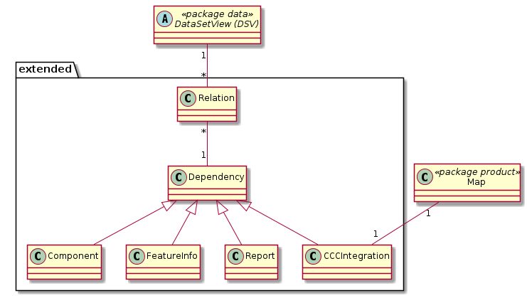

# Extended

Enthält die erweiterten Konfigurationen zu einer DSV:
* Component: Komponenten (Applikationen) innerhalb und ausserhalb der GDI, welche Informationen von der DSV beziehen.
* FeatureInfo: Konfiguration von speziellen Feature-Infos
* Report: Für ein DSV konfigurierter Report (Mit weiteren Abhängigkeiten auf andere DSV, falls zutreffend)
* CCC: Konfiguration einer CCC-Integration

## Klasse Relation

Bildet die Beziehungstypen Abhängigkeit und Anzeige zu den entsprechenden Datasetviews ab.  
Der Anzeige-Beziehungstyp ist nur relevant für FeatureInfo und Report. Er definiert, für welches Datasetview das Custom-Featureinfo / der Report angezeigt wird.

### Attributbeschreibung

|Name|Typ|Z|Beschreibung|
|---|---|---|---|
|relation_type|enum|j|Beziehungstyp (Anzeige oder Abhängigkeit). Codiert als 1_display und 2_data|

### Konstraints

UK über relation_type und die FK's auf Datasetview und Dependency. Beispiel: Eine FeatureInfo-Dependency kann für ein Datasetview

* maximal einmal als Anzeige-Abhängigkeit
* maximal einmal als Daten-Abhängigkeit

konfiguriert werden.

## Klasse Dependency

Abstrakte Basisklasse aller Abhängigkeitstypen (Featureinfo, CCC, ...). Dient als "Anknüpfpunkt" für die Klasse Relation und umfasst die allen Abhängigkeitsypen gemeinen Attribute.

### Attributbeschreibung

|Name|Typ|Z|Beschreibung|
|---|---|---|---|
|name|String(100)|j|Benennung der Beziehung. Wird in der Anzeige der Abhängigkeiten verwendet.|
|remarks|String|n|Interne Bemerkungen zur Konfiguration|

## Klasse FeatureInfo

Custom-Featureinfo Konfiguration für die als Anzeigeabhängigkeit verknüpfte Datasetview.

### Attributbeschreibung

|Name|Typ|Z|Beschreibung|
|---|---|---|---|
|displayTemplate|String|n|Jinja Template für komplett selbstdefinierte Anzeige des Features / der Rasterzelle|
|sqlQuery|String|n|SQL-Query, welches auf der "Quell-DB" der TableView die anzuzeigenden Attribute zurückgibt.|
|pyModuleName|String(100)|n|Name des Python-Moduls, welches die anzuzeigenden Attribute als Funktions-Rückgabewert zurückgibt|

### Konstraints

Nicht implementierter Constraint: Die Angabe von sowohl sqlQuery wie pyModuleName macht keinen Sinn. Falls so konfiguriert wird zufällig das eine oder andere ausgeführt.

## Klasse Component

Ueber die Klasse Component werden Abhängigkeiten von Drittsystemen auf die entsprechende Datasetview dokumentiert und konfiguriert.

### Attributbeschreibung

Keine spezifischen Attribute.

## Klasse CCCIntegration

Konfiguration der entsprechenden CCC-Integration. Die Datasetviews, von welchen die CCC-Integration abhängig sind müssen manuell aus den Json gelesen und als entsprechende Datenabhängigkeiten konfiguriert werden (Die Json werden nicht geparsed).

### Attributbeschreibung

|Name|Typ|Z|Beschreibung|
|---|---|---|---|

## Klasse Report

Relevanz nur bezüglich der Abhängigkeits-Anzeige oder auch Funktional?

### Attributbeschreibung

|Name|Typ|Z|Beschreibung|
|---|---|---|---|

