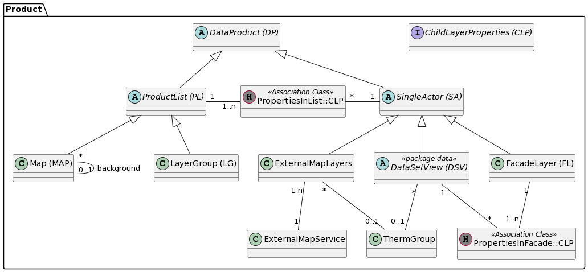

# Product

Bildet alle möglichen Arten von Kartenebenen und deren Beziehung untereinander ab.

## Klasse DataProduct (DP)

Basisklasse aller Datenprodukte.

Beispiel tabellarische Daten: Wenn ein DataProduct genau eine Tabelle umfasst ist es ein Objekt
der Subklasse DataSetView, wenn es mehrere Tabellen umfasst ein Objekt der Subklasse Productset respektive FacadeLayer.

Der Dateninhalt von externen Diensten wird nach Bedarf ebenfalls als DataProduct geführt.
Beispiele:
* WMS-Ebene eines Nachbarkantones, welcher in eine vorkonfigurierte Karte des Kantons Solothurn aufgenommen wird.
* WMS-Ebene der Fachapplikation Altlast4Web welche in eine thematische Karte des Web GIS Clients eingebunden werden soll.

### Attributbeschreibung

|Name|Typ|Z|Beschreibung|
|---|---|---|---|
|identPart|String(100)|n|Manuell erfasster (Teil-)Identifier|
|hasFullIdent|Boolean|j|Ist in identPart ist der komplette Identifier enthalten? Beispielsweise themenübergreifende Datenprodukte|
|pubScope|enum|j|Gibt an, in welchen Diensten und Applikationen das DP publiziert ist. Details siehe [hier](../metamodel.md#ebenenpublikation-in-dataproduct).|
|keywords|String(200)|n|**DEPRECATED** Stichworte für das DataProduct. Können auch thematische Überbegriffe sein.|
|remarks|String|n|Interne Bemerkungen.|
|synonyms|String(200)|n|**DEPRECATED** Synonyme für das DataProduct.|
|title|String(200)|n|Angezeigter Titel (Bezeichnung) des Dataproduct. Falls null in Erstellungsphase wird identifier verwendet.|
|description|String(1000)|n|Beschreibung. Ziel: < 500 Zeichen Text. Kann HTML-Markup enthalten (\<br\/\>, \<a ...\>\<\/a\>)|
|_identUnique|String(100)|j|Zusammengesetzter eindeutiger identifier. Idee: \[ThemePub-UUID\].identPart|

### Identifier (Attribut identPart)

Der Identifier der Themenbereitstellung ist die Basis der DataProduct-Identifier. Im Attribut "identPart" wird neu meist nur noch der Suffix zum Identifier der Themenbereitstellung erfasst. Der gesamte Identifier für das DataProdukt leitet sich aus der Beziehung zur ThemePublication und dem "identPart"-Attribut ab.

### Representatives DataProduct für eine ThemePublication

Häufig gibt es unter allen DP ein "spezielles", welches eine ThemePublication am treffendsten darstellt. Für das representative DP ist "identPart" = NULL. Der resultierende Identifier ist damit identisch mit dem Identifier der ThemePublication.

### Themenübergreifende DP

Vereinzelt gibt es themenübergreifende FacadeLayer und Layergruppen, welche nicht "mehrheitlich" einem Thema zugewiesen werden können.

Diese haben damit konsequenterweise keine Beziehung zu einer ThemePublication (FK = NULL). Das Attribut identPart enthält den vollen Identifier (Beispielsweise ch.so.afu.bohrungen).

### Konstraints

Feld "_identUnique" ist GDI-weit eindeutig.

## Interface ChildLayerProperties

Die Attribute des Interface definieren die Reihenfolge und überschriebene Eigenschaften (Bsp. Transparenz) einer Ebene innerhalb 
der übergeordneten Gruppe von Ebenen.

#### Attributbeschreibung

|Name|Typ|Z|Beschreibung|
|---|---|---|---|
|sort|int|j|Sortierindex der Ebene innerhalb der ProductList.|

## Rund um Klasse "ProductList"

### Klasse ProductList

Sortierte Liste von Einzellayern (=SingleActor), welche im Web GIS Client „explodiert“ dargestellt wird.

Beispiele: 
* Sortierte Liste von Einzeldatensatzdarstellungen (=DataSet), die gemeinsam als Kinder eines WMS "Parent-Layer" dargestellt wirden.
* Sortierte Liste von SA's für eine Map

#### Attributbeschreibung

ProductList hat keine weiteren eigene Attribute.

### Klasse Map

Die enthaltenen SingleActor können aus beliebigen thematischen Kontexten zusammengesetzt sein.

Da eine Map häufig aus 1-n LayerList's zusammengesetzt wird: Im GUI wird eine Hilfsfunktion implementiert, 
mit welcher in der Karte noch nicht vorhandene SA's einer LG beigefügt werden können.

#### Attributbeschreibung

|Name|Typ|Z|Beschreibung|
|---|---|---|---|
|background|boolean|j|DEPRECATED: Gibt an, ob es sich um eine Hintergrundkarte handelt oder nicht.|

DEPRECATED: Die drei Hintergrundkarten der GDI werden als normale facadelayer abgebildet und im SQL-Code der 
Pipeline über ihre Identifier (ch.so. ...) identifiziert. --> Backgroud-Flag ist überflüssig, Map enthält 
ausschliesslich Vordergrundkarten.

### Klasse LayerGroup (LG)

Die enthaltenen SingleActor haben einen engen thematischen Kontext.

#### Attributbeschreibung

LL hat keine weiteren eigene Attribute.

### Klasse PropertiesInList

Attributierte Verknüpfungstabelle der m:n Beziehung zwischen FL und DSV.

Attribute siehe Strukt "ChildLayerProperties"

## Rund um Klasse SingleActor

### Klasse SingleActor (SA)

Einzelebene oder FacadeLayer. Verhält sich in den Clients immer wie eine einzelne Ebene. Die Kindebenen eines FacadeLayer
erscheinen beispielsweise nicht als WMS-Ebene und werden in der TOC des Web GIS Client nicht angezeigt.

#### Attributbeschreibung

|Name|Typ|Z|Beschreibung|
|---|---|---|---|
|transparency|int|j|Transparenz in %. Default: 0%|
|customLegend|byte[]|n|Dateiinhalt der Custom-Legende (falls vorhanden)|
|customLegendSuffix|String(100)|n|Dateityp-suffix der Custom-Legende (falls vorhanden).|

Der customLegendSuffix wird aus dem Namen der hochgeladenen Datei extrahiert und nicht harmonisiert.
Beispiel: Jpeg-Dateien können als suffix jpeg oder jpg enthalten sein.

Die Transparenz der Facadelayer ist aufgrund eines alten Workarounds nicht im Regler im Web GIS Client
TOC steuerbar. Das Attribut transparency also für Facadelayer nicht aktiv.

### Klasse FacadeLayer (FL)

Aggregationslayer, welcher von den Applikationen als ein Layer angesprochen wird.

Layereigenschaften wie Sichtbarkeit und Transparenz wirken sich nur auf den FacadeLayer als ganzes aus und nicht 
individuell auf die im Facadelayer enthaltenen Unterlayer. Die enthaltenen Unterlayer sind im TOC nicht sichtbar.

Beispiel: Plan für das Grundbuch.

#### Attributbeschreibung

FL hat keine weiteren eigene Attribute.

#### Bemerkungen

Die Anforderungen an das Modell bewirken, dass LayerList und Facadelayer neu im Modell "weit entfernt" sind.
Die Umwandlung von FL zu LL oder umgekehrt erfordert also etwas Handarbeit.

### Klasse DataSetView (data)

Siehe [Beschreibung in Modell "Data"](data.md#klasse-datasetview-dsv) 

### Klasse PropertiesInFacade

Attributierte Verknüpfungstabelle der m:n Beziehung zwischen FL und DSV.

Attribute siehe Strukt "ChildLayerProperties"

#### Konstraints

UK über die FK's.

### Klasse ExternalWmsLayers

Externe WMS Ebene, welche im Web GIS Client und im SO-Locator wie interne Ebenen gesucht 
und geladen werden kann.

Definition "Extern": Die Rohdaten der Ebene sind nicht als DataProduct erfasst. Gründe für nicht erfasste Rohdaten:
* Stammt aus Dienst eines Servers ausserhalb des Kantons Solothurn.
* Stammt aus Dienst einer Fachapplikation. 

#### Attributbeschreibung

|Name|Typ|Z|Beschreibung|
|---|---|---|---|
|externalIdentifier|String(1000)|j|Identifier der Ebene im referenzierten ext. WMS-Service.|

### Klasse ExternalWmsService

Externer WM(T)S Service, von welchem 1-n Ebenen im WGC oder SO-Locator gesucht und geladen werden können. 

#### Attributbeschreibung

|Name|Typ|Z|Beschreibung|
|---|---|---|---|
|featureInfoFormat|enum(String)|j|Formatanforderung des FeatureInfo-Request an den WMS (text/plain, ...). "fi_unavailable" Falls der Server kein FeatureInfo kann.|
|url|String(255)|j|URL des Service. Falls WMTS die URL der GetCapabilities-Abfrage.|
|remarks|String|n|Interne Bemerkungen.|

## Klasse PropertiesInList

Attributierte Verknüpfungstabelle der m:n Beziehung zwischen PL und SA.

### Attributbeschreibung

|Name|Typ|Z|Beschreibung|
|---|---|---|---|
|sort|int|j|Sortierindex der Ebene innerhalb der ProductList.|
|visible|boolean|j|Ist die Ebene in der ProductList per default sichtbar oder nicht? Default: Ja.|

### Konstraints

UK über die FK's.

## Klasse ThermGroup (Schlüsselwort-Gruppe)

Definiert die Synonyme und Stichworte für einen "Kontext". Der Kontext wird mit dem Attribut "name" gekennzeichnet und kann ein Thema, eine Tabelle, ein DataSetView sein.

Falls mit "name" ein ganzes Thema als Kontext erfasst ist, wird die ThermGroup jeder DSV im Thema zugewiesen.

### Attributbeschreibung

|Name|Typ|Z|Beschreibung|
|---|---|---|---|
|name|String(255)|j|Kennung für den Kontext, für welchen die ThermGroup erstellt wurde (und gültig ist). \[Thema\] (z.B: geologie) \[Thema\].\[Tabelle\] (z.B: geologie.grundschicht)|
|keywords|String(800)|n|Als Json-Array formattierter String aller Keywords dieser ThermGroup|
|synonyms|String(800)|n|Als Json-Array formattierter String aller Synonyme dieser ThermGroup|