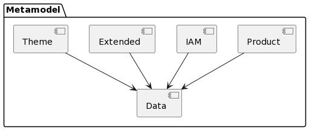

# Dokumentation Metamodell

## Teilmodelle



* **Product [[Link]](product.md):** Enthält die Klassen für die Konfiguration der aus Data abgeleiteten Produkte. 
* **Data [[Link]](data.md):** Enthält die Klassen für die Beschreibung der von der GDI genutzten 
Datenquellen (GIS-Tabellen, Raster, ...).
* **IAM [[Link]](iam.md):** Klassen zur Konfiguration des Identity und 
Access Management (Benutzer, Gruppen, Rollen, ...).
* **Extended [[Link]](extended.md):** Erweiterte Konfiguration zu einem DSV (Featureinfo, Report, Abhängigkeiten, ...).

## Konstraints

Für alle \*:\* Beziehungen in den Teilmodellen ist ein UK über die FK's zu erstellen.

## Erläuterungen zur Kapitelstruktur innerhalb der Teilmodelle

Strukturierung der *.md der Teilmodelle:
 
```
# [Name des Teilmodelles] --Erläuterungen zum ganzen Teilmodell
## Modell-Konstraints -- Falls zutreffend
## Klasse [Klassenname] -- Erläuterungen zu einer Klasse des Teilmodelles
### Attributbeschreibung -- Tabellarische Beschreibung der Attribute
### Konstraints -- Falls zutreffend
```

### Spalten der Attributbeschreibung

* **Name:** Attributname
* **Typ:** Java-Datentyp des Attributes. String wird zusätzlich mit der Länge qualifiziert.
* **Z:** Ist das Attribut **z**wingend erforderlich? (j,n)
* **Beschreibung:** Erläuterungen zum Attribut

Die Attributtabellen sind sortiert gemäss:
1. Zwingende alphabetisch
2. Optionale alphabetisch