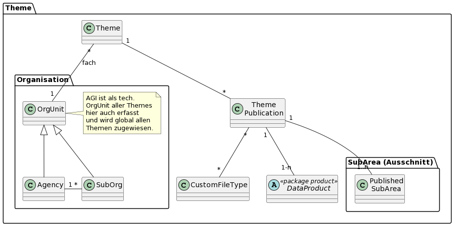

# Theme

Bildet die Themen und Themenbereitstellungen ab (Datenbezug)

## Bemerkungen 

### Unter-Package "SubArea"

Die Geometrien werden mittels GRETL-Job in die SIMI-DB kopiert.

Dokumentation siehe [hier](theme_subarea.md)

## Klasse Theme

Aufgrund der fachlichen (nicht technischen) Auseinandersetzung definiertes Thema, für welches Geodaten für den Bezug bereitgestellt werden. Der Nachführungsprozess bestimmt die Zugehörigkeit der Tabellen, ... zu einem Thema.   
Bei Vektordaten gilt meist: Umfang des Publikations-Modelles = Datenumfang eines Themas. 

Im Datenschatz von Solothurn bestehen zwei Haupt-Typen von Themen:

* **Typ Einzelthema:** Thematisch eng umrissenes fachlich begründetes Thema. Beispiel: Bienenstandorte.
* **Typ Themengruppe:** "Superthema", welches mehrere fachlich eng umrissene Einzelthemen zusammenfasst. Meist mit dem Hintergrund eines gemeinsamen Nachführungs- / Bewilligungsablaufes. Beispiele: AV, Nutzungsplanung.

Für die Steuerung der GDI macht es keinen Unterschied, ob ein Thema ein Einzelthema oder eine Themengruppe ist, darum sind die Subklassen Einzelthema und Themengruppe nicht ausmodelliert.

### Attributbeschreibung

|Name|Typ|Z|Beschreibung|
|---|---|---|---|
|identifier|String(100)|j|Eindeutiger Identifier des Themas (ch.so.\[Amt\].\[Thema\]).|
|coverageIdent|String(100)|j|Identifier der Datenabdeckung (DataCoverage) dieses Themas.|
|title|String(200)|j|Angezeigter Titel des Themas.|
|description|String(1000)|j|Kurze fachliche Bescheibung des Themas. Ziel: < 500 Zeichen Text. Kann HTML-Markup enthalten (\<br\/\>, \<a ...\>\<\/a\>)|
|remarks|String|n|Interne Bemerkungen.|
|keywords|String(500)|n|Stichworte. Können auch thematische Überbegriffe sein. Als Json-Array formatiert.|
|synonyms|String(500)|n|Synonyme, sprich alternative treffende Titel für das Thema. Als Json-Array formatiert.|
|remarks|String|n|Interne Bemerkungen.|

### Konstraints

UK auf identifier.

## Klasse ThemePublication

Konkrete Bereitstellung(en) eines Themas für einen Nutzungszweck. Beispiel Thema Verkehrszählung:

* Nutzungszweck lesend / darstellend: Bezug von ch.so.avt.verkehrszaelstellen (Strukturiert nach Pub-Modell).
* Nutzungszweck "komplexe Weiterverarbeitung", in welcher die relationale Gliederung von Vorteil ist: Bezug von ch.so.avt.verkehrszaelstellen.struct (Strukturiert nach Edit-Modell).

### Attributbeschreibung

|Name|Typ|Z|Beschreibung|
|---|---|---|---|
|type|Enum|j|Typ der Publikation: vecSimple, vecRelational, nonVec, other. Bei vec* werden die verfügbaren Dateitypen automatisch hergeleitet.|
|typeSuffixOverride|String(50)|(n)|Explizit gesetzter Suffix für den identifier. Bsp. **kommunal** für kommunale Nutzungsplanung. Resultierender Identifier: ch.so.arp.nutzungsplanung.kommunal|
|_typeSuffix|String(50)|j|Aus den type* Attributen hergeleiteter Suffix des Identifiers (Hilfsattribut, readonly)|

### Konstraints

UK über _typeSuffix, "FK auf Thema".

## Klasse FileType

Informationen zu einem zum Download bereitgestellten Dateityp. Zip wird nicht erfasst, da immer als Ordner verwendet. Für die Benutzer nicht hilfreich, wenn
beim Format jeweils immer "zip" steht.

### Attributbeschreibung

|Name|Typ|Z|Beschreibung|
|---|---|---|---|
|mimeType|String(255)|j|Mime-Type des Dateityps. Attribut ist auch der identifier für die automatische Zuordnung der "Vektor-Gebrauchsformate".|
|name|String(100)|j|Sprechender Name des Dateityps.|
|kuerzel|String(50)|j|Suffix für Dateien dieses Typs für die Benennung des entsprechenden ZIP (xtf, itf, shp, gpkg, ...).|

### Konstraints

Separate UK auf mimeType, name, kuerzel.

## Klasse DataSetView

Siehe [DataSetView](data.md#klasse-datasetview-dsv) in Teilmodell "Data".

### Konstraints

* Keine Zuweisung auf TableViews mit "Rowfilter-View"
* Innerhalb der gleichen Themen-Bereitstellung:
  * TableViews müssen aus dem gleichen Schema stammen
  * Kein Gemisch von TableView und RasterView

## Klasse OrgUnit

Organisationseinheit, welche zu den Themen-Bereitstellungen fachlich oder technisch Auskunft geben kann.

Da die technische Auskunft immer durch das AGI erfolgt, wird nur die Beziehung für die fachliche Auskunft ausmodelliert.

### Attributbeschreibung

Keine Attribute.

## Klasse Agency

Informationen zum Amt (AfU, ARP, AGI, ...). Hinweis: Punktuell ist der Klassenüberbegriff "Amt" nicht ganz zutreffend (Beispielsweise bei Daten der Solothurnischen Gebäudeversicherung).

### Attributbeschreibung

|Name|Typ|Z|Beschreibung|
|---|---|---|---|
|name|String(100)|j|Name des Amts. Bsp: "Amt für Geoinformation"|
|kuerzelAmt|String(10)|j|Kürzel für das Amt (AfU, ARP, ...).|
|kuerzelStufe|String(10)|j|Kürzel für die Stufe. Default: Amt.|
|url|String(100)|j|URL der Homepage des Amts.|
|telefon|String(20)|j|Kennung und Vorwahl innerhalb CH: 032 212 66 77|
|email|String(50)|j|Email-Adresse des Amtes|

### Konstraints

UK auf name.   
UK auf kuerzelAmt.

## Klasse SubOrg

Unterorganisation innerhalb eines Amts. Der Einfachheit halber wird nur eine Hierarchiestufe ausmodelliert (Es gibt keine SubSubOrg). Beispiel für die Erfassung eines Fachbereiches als SubOrg: "Fachbereich Altlasten (Abteilung Boden)".

### Attributbeschreibung

|Name|Typ|Z|Beschreibung|
|---|---|---|---|
|name|String(100)|j|Name der Unterorganisation. Bsp: "Abteilung Boden".|
|url|String(100)|n|URL der Homepage des Amts.|
|telefon|String(20)|n|Kennung und Vorwahl innerhalb CH: 032 212 66 77.|
|email|String(50)|n|Email-Adresse des Amtes.|

### Konstraints

UK auf name und FK zum Amt (Wird nur bei kleinem Aufwand umgesetzt).

## Modellierungsvarianten ILI-Modell -> Klasse -> Attribut

* Ueber DSV (Dokumentierte Version):
  * Vorteile:
    * Den Benutzern im AGI vertraut
    * Durchgängig gleich für alle Datentypen (Vektor, Raster, ...)
    * Konsistent bezüglich Keywords, Synonyms
    * (Verknüpfung zu den Rollen besteht bereits für allfälligen Bezug von zugriffsgeschützten Dateien)
  * Nachteile:
    * "Identifier-Inflation": Beispielsweise ch.so.agi.gebaeude.adressen_bezug für Bezug und ch.so.agi.gebaeude.adressen_view für WGC, WMS
    * Erfassungsfehler möglich, da ohne Validierung Konf <> Modell. Impact ausschliesslich auf die Dokumentation.
      * Erfassung kann nach Bedarf unterstützt werden --> $td Abklären t_ili2db_attrname, t_ili2db_inheritance.
* Ueber PostgresTable (Alternativ - Nicht ausmodelliert):
  * Beschreibung: 
    * Im Theme werden die Modelle eingetragen. Die geschützten Attribute in der PostgresTable markiert.
    * Vorteile:
      * "Konfiguration näher im Keller"
    * Nachteile:
      * Keywords, Synonyms
      * Unterschiedliche Konfigurationsart bezüglich der Attribute
      * Andere Konfiguration Vec, Non-Vec