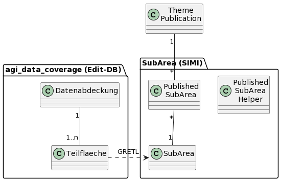

# SubArea (Theme)

Dokumentiert die Klassen des Package Theme.SubArea (SIMI) und die Zusammenhänge zum Modell "SO_AGI_Meta_Datenabdeckung_YYYYMMDD". Das Modell ist im Schema agi_data_coverage auf der Edit-DB implementiert.

## Klasse PublishedSubArea

Mit dem "published" Timestamp wird in dieser Klasse gespeichert, wann ein Teilgebiet einer Themenpublikation das letzte Mal publiziert wurde. "published" wird für Vektordaten via GRETL-Publisher geschrieben.

### Attributbeschreibung

|Name|Typ|Z|Beschreibung|
|---|---|---|---|
|published|DateTime|j|Letzte (aktuellste) Publikation dieses Teils der ThemenBereitstellung.|
|prevPublished|DateTime|j|Vorletzte Publikation dieses Teils der ThemenBereitstellung.|

### Konstraints

UK über die FK.

## Klasse SubArea

Fläche eines Teilgebietes des Kanton Solothurn. Alle 1-n Teilgebiete der gleichen Datenabdeckung bilden zusammen ein AREA-Datensatz, welcher 
die Datenabdeckung innerhalb des Kt. Solothurn dokumentiert.

Wird mittels GRETL-Job aus dem Schema "agi_data_coverage" (Modell SO_AGI_Meta_Datenabdeckung_YYYMMMDD) gepflegt (Bulk InsUpdDel). Trägt darum auch nicht die gewohnten Meta-Attribute zu Zeitpunkt und Benutzer der Erstellung eines Objektes (Vererbt nicht von SimiEntity sondern von BaseUuidEntity).

### Attributbeschreibung

|Name|Typ|Z|Beschreibung|
|---|---|---|---|
|identifier|String(100)|j|Eindeutige Kennung des Teilgebiets.|
|coverageIdent|String(100)|n|Kennung der Datenabdeckung des importierten Teilgebiets (Sprechender FK auf die Datenabdeckung in der Edit-DB). |
|geomWKB|byte[]|j|Polygon-Geometrie des Teilgebietes als WKB.|
|title|String(255)|n|Sprechender Titel des Teilgebiets.|

### Konstraints

UK über identifier, coverageIdent, updated

# Ablauf der Datensynchronisation

* db2db mit `update = null`
* Update der bestehende Beziehungen von PublishedSubArea auf die neu importierten SubArea
* Alle Subareas löschen: `where update is not null`
* Version für neu importierte setzen: `update = now()`

# Ablauf bei PUT-Aufruf durch Publisher

## 1. Publisher sendet Aktualisierung

    {
      "dataIdent": "ch.so.afu.gewaesserschutz",
      "published": "2021-12-23T14:54:49.050062",
      "partIdentifiers": ["224", "225"]
    }

## 2. Aktualisierung PublishedSubArea

* Falls PublishedSubArea bereits vorhanden:
  * Dieses Aktualisieren (Timestamp).
* Sonst:
  * Neues PublishedSubArea erstellen.