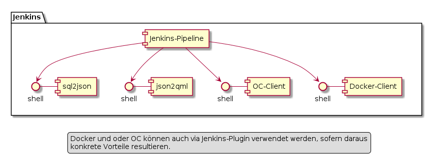

# K4 - Magicbutton-Pipeline

## Aufbau der Pipeline

Die "Zudien-Programme" der Pipeline werden im Pipeline-Skript direkt via Shell oder ähnlich
als Kommandozeilenprogramme aufgerufen (ohne Agent's). 

### Potentiale zur Verkürzung der Laufzeit
* Generieren der *.json mit neuem Kommandozeilen-Tool "sql2json".
Dieses holt die notwendigen Informationen mittels weniger queries aus der DB 
und sollte damit massiv schneller sein wie der Code des ehemaligen Permission 
(aka Config) Service.
* Image-Erstellung: Caching des Basis-Image
Der Build eines Image nimmt aktuell rund eine Minute in Anspruch. Das jeweilige
Basis-Image wird bei jedem Build heruntergeladen. Die Zeit für das Herunterladen
kann durch die Nutzung des Cache eingespart werden.

## Aufruf der Pipeline

Die Ausführungszeit der Pipeline wird zwischen 2-3 Minuten liegen. 
Um für das Fortschritts-Feedback möglichst Standardfunktionalität nutzen zu können,
ruft SIMI mittels Link die Build-Ansicht von Jenkins auf. Das Auslösen (Starten) der 
Pipeline erfolgt über das Jenkins-API.

### Starten des Builds "ConfigUpdate"

Mittels call auf das HTTP API und Übergabe des Berechtigungs-Token.

https://jenkins:8080/job/configupdate/build?token=9VnZLGtxXGfS9y

Falls für die Benutzer von SIMI zuwenig klar ist, wer welchen Build ausgelöst hat, 
kann dies zu einem späteren Zeitpunkt mittels "cause" verdeutlicht werden. 

https://jenkins:8080/job/configupdate/build?token=9VnZLGtxXGfS9y&cause="Ausgelöst von Roland Schmid"

Nach dem Starten des Builds öffnet SIMI in einem neuen Browserfenster die Build-Ansicht von Jenkins.

https://jenkins:8080/job/configupdate

### Konfiguration der Berechtigungen in Jenkins
* Modifizieren des Build "ConfigUpdate": Entsprechend berechtigte und in Jenkins eingeloggte Benutzer
* Starten des Build "ConfigUpdate": Alle Programme / Personen, welche im Besitz des korrekten Token sind.
* Anschauen der letzten "ConfigUpdate" Builds: Jedermann (Anonymous) - Ohne Login ins Jenkins.