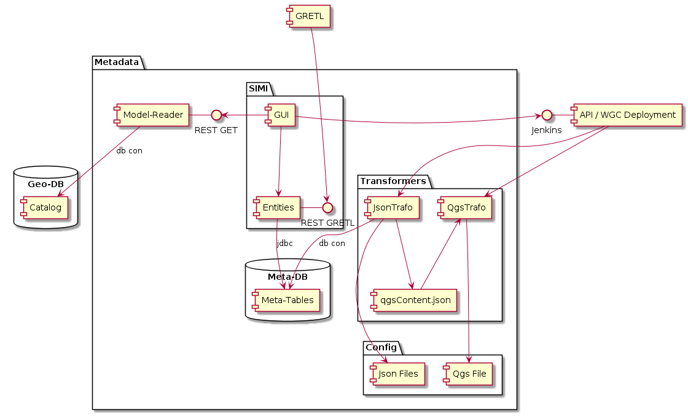

# Lastenheft QgsTrafo und Anpassungen an bestehenden *.json Config-Dateien

Umfang des Auftrages ist:
* QGSTrafo
  * Entwurf und Feedbackeinarbeitung zu im Auftrag entstehendem qgsContent.json
  * Erstellung des Python Kommandozeilenprogrammes, welches aus qgsContent.json und Template-Datei die QGIS-Server-Datei estellt (*.qgs).
* Anpassungen an bestehenden *.json Config-Dateien und Komponenten
  * Restlos alle notwendigen Informationen sind in den *.json enthalten (Bilder, ...). Die Komponenten lesen neu die Informationen einzig aus dem entsprechenden *.json.
  * cccConfig.json: cccServer-URL kann ebenfalls mittels ENV-Variable überschrieben werden
* Erweiterung der Dokumentation / Frageklärung
  * Welche Eigenschaften des DataProduct-Service vom Web GIS Client benötigt werden.
  * Wie die Eigenschaften in den *.json bezüglich Transparenz zu verstehen sind.

## Gemeinsame Anforderungen für bestehende *.json und qgsContent.json 

|ID|Anforderung|
|---|---|
|1.1|Binäre Informationen (Legendenbilder, ...) werden als base64-Strings in die *.json encodiert|
|1.2|XML und allfällige weitere Konfigurationssprachen werden als UTF8-byte[] in base64 encodiert|

## QGSTrafo

### Überblick und Einbettung des QGSTrafo in das Gesamtsystem



Relevant für das Verständnis des Auftrages ist das package "Transformers":

Die Komponenten der GDI werden mittels json-Dateien konfiguriert. Die Json's werden mittels des Transformers "JsonTrafo" erzeugt. 
Der JsonTrafo integriert mittels templating SQL-Abfrageresultate in ein Json-Gerüst und gibt das resultierende Json aus.
Für den QGIS-Server wird ein XML-basiertes *.qgs (*.qgz) benötigt, in welchem Datenquelle, Whereclause, Darstellung, Gruppierung, ... 
der Ebenen abgebildet ist. Das *.qgs wird aus dem im Rahmen dieses Auftrages zu spezifizierenden "qgsContent.json" erzeugt.

Der JsonTrafo wird vom AGI erstellt und ist nicht Teil des Auftrags.

### Anforderungen
|ID|Anforderung|
|---|---|
|2.1|Die vom QgsTrafo eingelesene Datei muss json sein, damit in den vorgelagerten SQL-Abfragen die mächtigen Json-Funktionen von postgreSQL genutzt werden können.|
|2.2|Bezüglich der QML wird von QGIS-Version 3.10 mit Speicherung der Assets als base64 im *.qml ausgegangen. Als Option bitte eine Umsetzung mit QGIS 2.18 offerieren, siehe Kapitel "Codierung der Assets ausserhalb QML".|
|2.3|Die grundsätzliche Funktionsweise des bestehenden "Magicbutton" wird beibehalten (Jinja-Template, Default-QGS, ...).|
|2.4|Als Erweiterung wird für Vektorebenen eine optionale Whereclause in das qgsContent.json integriert. Diese muss an den korrekten Stellen jeweils im *.qgs eingefügt werden.|
|2.5|Konfiguration: Der QgsTrafo wird mittels Kommandozeilenaufruf gestartet. Im Aufruf werden die folgenden Parameter übergeben:<br>- Pfad zur QGS-Template Datei<br>- Pfad zu "qgsContent.json"<br>- Pfad zu den Default-Qml<br>- Pfad, unter welchem das erzeugte QGS abgelegt wird<br>- Der Loglevel. Sofern nicht angegeben kommt der Default-Loglevel "Info" zum Einsatz.|
|2.6|Logging: Bei Loglevel "Info" wird für jede Verarbeitung eines Jinja-Templates 1-2 Logs auf den Standard-Output ausgegeben. Bei Debug zusätzlich 1-2 Logs für die Verarbeitung jedes Layers (Sowohl für die Gruppen, wie auch die Einzellayer).|
|2.7|Performance: Ein qgsContent.json mit 300 "real World" Ebenen muss in unter 5 Sekunden in das resultierende *.qgs generiert werden.|
|2.8|Ablage des Sourcecode: OpenSource auf Github.|
|2.9|Dokumentation: als *.md im Repo. Umfasst Kapitel zur Installation, Programmausführung, und die Schrittweise Anleitung bei Migration auf eine höhere QGIS Server Version.| 
|2.10|Bereitstellung: Shell oder Python-Script, welches das Kommandozeilenprogramm inklusive seiner Abhängigkeiten in einer pyvenv installiert (mittels requirements.txt).|

### Codierung der Assets ausserhalb QML

Im Block der Eigenschaften der "Einzel-Ebene" werden im Array qmlAssets die Assets codiert.
Universell mit vollem relativem Pfad zum QML. Der QgsTrafo muss dann das base64 decodieren, die Dateien erstellen und relativ zum qgs gemäss "fullPath" ablegen.

```json
{
    "..." : "...",
    "qmlBase64" : "TWFuIGlzIGRpc3Rpbmd1aXNoZWQsIG5vdC ...",
	"qmlAssets": [{
		"fullPath": "fillpattern/myCrossPattern.svg",
		"base64": "as0987sdf"
	}, {
		"fullPath": "symb/grosseSchuettung.png",
		"base64": "mnxbcv709870"
	}]
}
```

## Anpassungen an bestehenden *.json Config-Dateien und Komponenten

|ID|Anforderung|
|---|---|
|3.1|Restlos alle notwendigen Informationen sind in den *.json enthalten (Bilder, ...). Die Komponenten lesen neu die Informationen einzig aus dem entsprechenden *.json.|
|3.2|cccConfig.json: cccServer-URL kann ebenfalls mittels ENV-Variable überschrieben werden. Heutiger Pfad: `config.clients[x].cccServer` Mögliche Lösung: cccServer-Eigenschaft "globalisieren" --> Neuer Pfad: `config.cccServer`|

## Vorgehen

Vor der Implementation wird die Struktur des qmlContent.json in zwei Schritten festgelegt:
* Entwurf: Die Struktur des entstehenden Json richtet sich einzig nach dem zu transportierenden Informationsgehalt. 
    * Er berücksichtigt keinerlei "Besonderheiten" der produzierenden und konsumierenden Seite (JsonTrafo, QgsTrafo)
    * Optionale, aber für einen Layer nicht vorhandene Attribute, werden explizit mit `null` deklariert. Beispiel: `"myOptionalValue" : null` 
* Im Rahmen einer Feedbackrunde (Halbtägiger Workshop) wird besprochen, ob und wie in Einzelfällen die Struktur    
nach den Bedürfnissen von QgsTrafo und/oder JsonTrafo angepasst werden kann.

Sprich: Vom bestehenden Code können die grundsätzlichen Ideen übernommen werden (Einsatz Jinja-Template, ...).
Der Codeaufbau wird aber wohl von Grund auf neu erfolgen, nicht zuletzt aufgrund der komplett neuen Datenquelle "qgsContent.json".

## Abgabetermin

Mitte November 2020.
 
