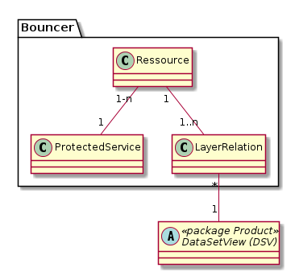

# Bouncer

Prüft für eine angeforderte Ressource, ob der Benutzer diese anfordern (lesen) darf. Uebersetzt den HTTP-GET Aufruf
an den Bouncer in den HTTP-GET Aufruf der mittels Bouncer geschützten Ressource des "background" Service.

Die URL für den Aufruf eines Background-Service via Bouncer setzt sich wie folgend beschrieben zusammen.

http://\[Bouncer BaseURL\]/\[ProtectedService\]/\[Ressource\]\[...\]. \[...\] sind beliebige weitere URL-Teile, 
die einfach hinten angehängt werden. Bis zum vorgelagerten Gateway resp. SES natürlich https://.

Beispiel: http://geo.so.ch/bouncer/dox42/naturreservate\[...\] 

Metamodell für die Bouncer-Konfiguration:

Beziehungen Ressource - SingleLayer:
* contains data: Beschreibt, aus welchen Ebenen eine Ressource Daten bezieht.
* display in feature info: Beschreibt, in welchen Ebenen die Ressource im FeatureInfo-Dialog des Web GIS Client zum Öffnen angeboten wird.

## Klassenbeschreibung

### Klasse ProtectedService

Service (des Servers), dessen Ressourcen via Bouncer geschützt werden. Beispielsweise "Jasper Server"

#### Attributbeschreibung

|Name|Typ|Z|Beschreibung|
|---|---|---|---|
|UrlTemplate|String(1000)|j|Template der URL des geschützten Service. In diese wird an der mittels Wildcard gekennzeichneten Stelle das UrlSnipplet der Ressource eingefügt.|
|Name|String(100)|j|Sprechender Name für die Ressource.|
|Remarks|String|n|AGI-Interne Beschreibung zur Ressource.|

### Klasse Ressource

Die Ressource, welche mit den Daten aus 1-n SingleLayern erzeugt wird. Typisches Beispiel ist ein Report, welcher
Daten in der Form von Tabellen / Karten / etc. ausgibt.

#### Attributbeschreibung

|Name|Typ|Z|Beschreibung|
|---|---|---|---|
|UrlSnipplet|String(100)|j|Schnipsel, welches vom Bouncer in das URL-Template des BackgroundService eingefügt wird, um die Ressource mittels HTTP anzufordern.|
|Name|String(100)|j|Sprechender Name für die Ressource. Muss ohne encoding als Unterpfad einer URL verwendet werden können. Sprich name = urlencode(name).|
|Remarks|String|n|AGI-Interne Beschreibung zur Ressource.|

### Klasse LayerRelation

Enthält die Konfiguration der Beziehungstypen Ressource - SingleLayer:
* queries: Beschreibt, aus welchen Ebenen eine Ressource Daten bezieht.
* show in feature info: Beschreibt, in welchen Ebenen die Ressource im FeatureInfo-Dialog des Web GIS Client zum Öffnen angeboten wird.

#### Attributbeschreibung

|Name|Typ|Z|Beschreibung|
|---|---|---|---|
|relationType|enum|j|Werte der enum: "show_in_fi" und "queries".|

#### Konstraints

Unique-Key über relationType und die beiden FK's auf Ressource und SingleLayer.