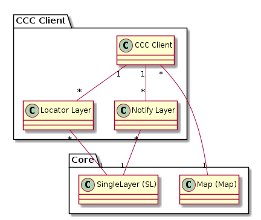

# CCC

## Klasse CCC Client

Repräsentiert die Anbindung einer Fachapplikation via CCC-Schnittstelle.

### Attributbeschreibung

|Name|Typ|Z|Beschreibung|
|---|---|---|---|
|key|String|Ja|Sprechender Key dieser Integration, welche als appIntegration URL-Parameter verwendet wird.|
|title|String|Ja|Titel, welcher für das "verheiratete" WGC-Fenster angezeigt wird.|
|editGeomType|enum|Ja|Geometrietyp, welcher für die Fachapplikation im GIS erstellt / editiert wird. Werte: Point (=Default), Line, Polygon|
|remarks|String|Nein|Interne Bemerkungen des AGI zu dieser Anbindung.|

## Klasse Locator Layer

Ebene, welche im Priority-Locator für das Heranzoomen vor dem Editieren genutzt wird. 
Beispiel mit zwei konfigurierten Ebenen:
1. Zoom auf ein Grundstück
2. Zoom auf eine Gemeinde

### Attributbeschreibung

|Name|Typ|Z|Beschreibung|
|---|---|---|---|
|sort_index|Integer|Ja|Sortierungsindex. Bestimmt, in welcher Priorität die Ebene für das Lokalisieren verwendet wird.|
|filter|String|Ja|Filter, mit welchem mittels Dataservice die zutreffenden Geometrien für das Lokalisieren abgefragt werden.|

### Konstraints

UK über filter und die beiden FK's.

## Klasse Notify Layer

Ebene, für die ein Rückaufruf GIS --> Fachapplikation über das Feature-Info Fenster konfiguriert ist.

### Attributbeschreibung

|Name|Typ|Z|Beschreibung|
|---|---|---|---|
|title|String|Ja|Bezeichnung, mit welcher der Rückaufruf im Feature-Info Fenster angezeigt wird.|
|attributeMap|Json|Ja|Mapping des im CCC-Protokoll verwendeten Attributnamens auf den Attributnamen des SingleLayer. Strukturierung siehe Doku des config.json für CCC.|

### Konstraints

UK über die FK's.

## Mapping auf den Inhalt von cccConfig.json

|cccConfig.json|simi|Bemerkungen|
|---|---|---|
|$schema|globals.ccc.schemaURI||
|service|globals.ccc.serviceName||
|config.clients.id|CCC Client.key||
|config.clients.cccServer|globals.ccc.cccServerUrl||
|config.clients.title|CCC Client.title||
|config.clients.map|CCC Client -> Map.identifier||
|config.clients.editGeomType|CCC Client.editGeomType||
|config.clients.notifyLayers.layer|Notify Layer -> SingleLayer.identifier|---|
|config.clients.notifyLayers.mapping|Notify Layer.attributeMap|Array von KeyValues: [{"agdi_attr_name": "laufnummer","ccc_attr_name": "geschaeft_laufnr"},{...}]|
|config.clients.notifyLinkTitle|Notify Layer[0].title|Unklar, wieso dies in config.Json nicht eine Kind-Eigenschaft von config.clients.notifyLayers ist.|
|config.zoomto_data_service_url|Dummy in globals.ccc.dataServiceUrl. Muss überschrieben werden mit: WGC ENV: "DATA_SERVICE_URL"||
|config.zoomto_full_extent|globals.ccc.fullExtent||
|config.zoomto_config.locatorType|globals.ccc.locatorType|Wert: PriorityLocator. In globals da dies bis auf Weiteres nicht ändern wird.|
|config.zoomto_config.filters.dataset|Locator Layer -> SingleLayer.identifier||
|config.zoomto_config.filters.filter|Locator Layer.filter||

