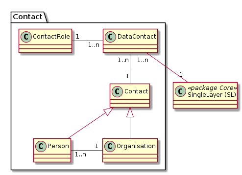

# Contact

 

Kontaktinformationen können einzig zu einem SingleActor erfasst werden. Auf Erfassung zu den folgenden Klassen wurde
verzichtet:
* Map: Information ist zu wenig wichtig.
* LayerList: Folgt aus SingleActor. Aufgrund des engen thematischen Kontext sollte eine LayerList nicht mehrere Datenherren haben.
* Softwarekomponenten: Die Informationen sind in der Doku zur jeweiligen Komponente enthalten und sind hier überflüssig. 

## Klasse DataContact

Beziehungstabelle in welcher jede Beziehung zwischen einem Kontakt und einem SingleLayer mit der entsprechenden Kontaktrolle qualifiziert wird.

### Konstraints

UK über die drei FK's.

## Klasse Contact

Basisklasse welche die gemeinsamen Eigenschaften von Person und Organisation vereint.

## Klasse ContactRole

Umfasst alle vorkommenden Kontaktrollen zwischen einem Kontakt und einem SingleLayer.

Beispiele für Kontaktrollen:
* Ist Datenherr von
* Hat Modell erstellt

## Klasse Organisation

Umfasst die notwendigen Informationen zu einer Organisationseinheit.

## Klasse Person

Umfasst die notwendigen Informationen zu einer Kontaktperson (intern und extern).