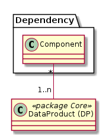

# Dependency (Abhängige Komponenten)

Beschreibt die internen und externen Komponenten, welche von Artefakten der GDI abhängig sind.

Beispiele für Komponenten:
* Plan für das Grundbuch (intern)
* WMTS (intern) 
* BauGK (extern)
* ArtPlus (extern)

Beispiele für Datenstrukturen:
* DataSetView: Beispielsweise die Abhängigkeit auf das gegenwärtige Schema.
* Map: Abhängigkeit auf den Identifier der Map aufgrund Nutzung der URL-Schnittstelle zum WGC 

 

Modelliert sind auch Abhängigkeiten einer Fachapplikation auf eine Map oder eine LayerList (Wie beispielsweise bei Baugis, ArtPlus der Fall)

Nicht Modelliert ist, auf welche Applikation / Service sich die Abhängigkeit bezieht (Ob auf WGC, WMS, DataService, ...).
Dies sollte der Dokumentation der Komponente entnommen werden können.

## Klasse Component

### Attributbeschreibung

|Name|Typ|Z|Beschreibung|
|---|---|---|---|
|name|String(100)|j|Benennung der Komponente.|
|remarks|String|n|Interne Bemerkungen zur Komponente.|

### Konstraints

UK auf "name".