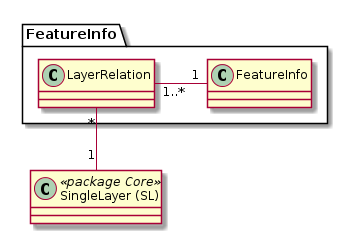

# Featureinfo

 

## Klasse Featureinfo

Enthält die Informationen bezüglich der verwendeten Quelle für die Layerabfrage 
und das Rendering-Template für die Ausgabe.

### Attributbeschreibung

|Name|Typ|Z|Beschreibung|
|---|---|---|---|
|displayTemplate|String|j|Jinja-Template, welches das Layout der Featureinfo-Ausgabe bestimmt.|
|sqlQuery|String|n|Query, welches gegenüber der konfigurierten Postgres-DB abgesetzt wird.|
|pyModuleName|String(100)|n|Name des Python-Modules, welches für die Informationsabfrage genutzt wird.|
|remarks|String|n|Interne Bemerkungen zur Konfig.|

### Konstraints

* Jedes Featureinfo muss genau einen "is_for_layer" Eintrag in der Klasse LayerRelation haben.
* Entweder sqlQuery oder pyModuleName muss Null sein.

## Klasse LayerRelation

Bildet die Beziehungen des Featureinfo zu einer DataSetView ab:
* **"is_for_layer":** Ziel-Layer, für welchen die Featureinfo erstellt wurde.
* **"queries":** Aus der Ebene wird via SQL oder Modul Informationen für dieses Featureinfo bezogen.

Mittels der "queries"-Verknüpfungen werden die Permissions geprüft und "Know your GDI" sichergestellt.
Bei einem sqlQuery wird über die erste queries-Verknüpfung die Datenbank ermittelt, auf die das Query abgesetzt wird.

### Attributbeschreibung

|Name|Typ|Z|Beschreibung|
|---|---|---|---|
|relation|enum|j|Beziehungstyp zwischen Featureinfo und SL (is_for_layer, queries).|

### Konstraints
UK auf FK's und "relation".