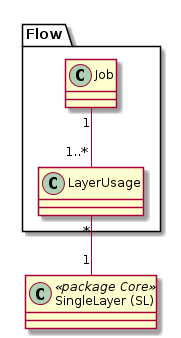

# Flow

Modelliert die Beziehungen des GRETL-Job zu SingleLayer.

### Klasse Job

Aus 1-n Tasks zusammengesetzter GRETL-Job. Abgebildet wird die zusammenfassende Sicht. Allfällige Staging-Zwischentabellen
sind nicht in "Flow" dokumentiert.

#### Attributbeschreibung

|Name|Typ|Z|Beschreibung|
|---|---|---|---|
|repoPath|String(200)|j|Pfad des Jobs ab "Repo-Root" ohne build.gradle Dateiname. Beispiel: "afu_baugrundklassen_pub".|

Auf ein "remarks" Attribt wird verzichtet. 
Bemerkungen sollen ins entsprechende build.gradle geschrieben werden.

#### Konstraints

UK über "repoPath".

### Klasse LayerUsage

Attributierte Verknüpfungstabelle. 

#### Attributbeschreibung

|Name|Typ|Z|Beschreibung|
|---|---|---|---|
|accessType|enum|j|Werte der Enumeration: "read" (default) und "write_read".|

#### Konstraints

UK über FK's.

 
  
 

