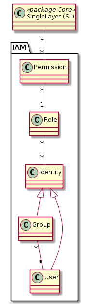

# IAM (Identity and Access Management)

Das IAM ist neu ausschliesslich Datenbezogen. Es gibt keine Anwendungsfälle, welche sich nicht immer
auf die Daten zurückführen liessen. Entsprechend werden die Berechtigungen einzig bezüglich des SingleLayer 
gesetzt.

## Modell-Konstraints

Ein Benutzer soll grundsätzlich nicht direkt und indirekt via Gruppe der gleichen Rolle zugewiesen werden. Dies ist
aber eher wichtig, um die Übersicht zu behalten, als dass Missachtung des Konstraints zum nicht Funktionieren der 
GDI führen würde. 

## Klasse Permission

Steuert, ob eine Rolle gegenüber einer Ressource gar keine, nur lesende, oder lesende und schreibende Berechtigung hat.

### Attributbeschreibung

|Name|Typ|Z|Beschreibung|
|---|---|---|---|
|level|enum|j|"read" = 1, "read_write" = 2. Sortierung muss in Datenbank entweder als int's oder als "1_read" etc. vorkommen, damit einfache Permission-Queries geschrieben werden können. SQL: `max(level) |
|priority|int|j|$td config.json anschauen. Priority wird hoffentlich durch Frühlingsrelease obsolet.|

### Konstraints

UK über FK's.

## Klasse Role (PermissionSet)

Bündelt 1-n Permissions gegenüber 1-n SingleLayer.

### Attributbeschreibung

|Name|Typ|Z|Beschreibung|
|---|---|---|---|
|name|String(100)|j|Name der Rolle.|
|remarks|String|n|AGI-Notizen zur Rolle.|

### Konstraints

UK auf "name".

## Klasse Group

Meist organisatorisch bedingte Gruppe, welche die gleichen Rollen gegenüber SingleLayer hat. 

### Attributbeschreibung

|Name|Typ|Z|Beschreibung|
|---|---|---|---|
|name|String(100)|j|Name der Gruppe.|
|remarks|String|n|AGI-Notizen zur Gruppe.|

### Konstraints

UK auf "name".

## Klasse User

Benutzer der GDI. Die Identität des Benutzers wird via SES des AIO verifiziert.

Es bestehen funktionale Einheiten der GDI mit eigenem (redundantem) Benutzerverzeichnis. Bsp: GRETL.

### Attribute

|Name|Typ|Z|Beschreibung|
|---|---|---|---|
|name|String(100)|j|Name des Benutzers.|
|vorname|String(100)|j|Vorname des Benutzers.|
|remarks|String|n|AGI-Notizen zum Benutzer.|

### Konstraints

UK über name, vorname und FK auf Klasse Team.

## Klasse Team

Organisationseinheit des User. AFU, ARP, ...

### Attribute

|Name|Typ|Z|Beschreibung|
|---|---|---|---|
|name|String(100)|j|Name der Organisationseinheit.|
|remarks|String|n|AGI-Notizen zum Benutzer.|

### Konstraints

UK auf name.

