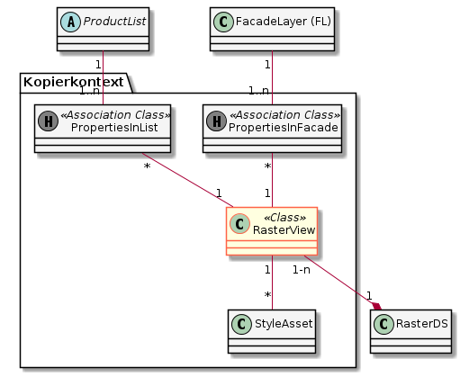

# SIMI

Webapplikation zur Pflege der Metainformationen der GDI-SO (**S**patial **I**nfrastructure **M**etadata **I**nterface)

Die Doku des Metamodells ist hier zuhause: [Doku des Metamodelles](metamodel.md)

## Setzen des Loglevels

Der Loglevel kann bequem mittels der vom Framework zur Verfügung gestellten Admin-Masken zur Laufzeit geändert werden.

Falls eine Fragestellung vor der Verfügbarkeit der Admin-Masken analysiert werden muss, kann der Loglevel in der
Datei **\[repo root\]/webapp/docker/image/uber-jar-logback.xml** wie folgend beschrieben angepasst werden (Bedingt neuen Build des Image):

Anpassung des levels, welcher überhaupt auf die Konsole geschrieben wird:

    <root level="debug">
        <appender-ref ref="Console"/>
    </root>

Anpassung des log-levels für das Cuba-Framework:

    <logger name="com.haulmont.cuba" level="DEBUG"/>
    
Anpassung des log-levels für Simi:

    <logger name="ch.so.agi.simi" level="DEBUG"/>
  
## Kopieren von Data-Products

Die im GUI harmlos erscheinende Kopierfunktion ist aufgrund der vielen zu berücksichtigenden Beziehungen
ziemlich komplex.

Die Klassen innerhalb des Kopierkontextes werden kopiert (dupliziert), die ausserhalb werden referenziert. 
Nach dem Kopiervorgang zeigt also sowohl das Original wie auch die Kopie auf das gleiche ausserhalb des
Kopierkontextes liegende Objekt.

Hinweis: Die Vererbungen sind in den Diagrammen nicht abgebildet.

### Tableview

### Rasterview

### FacadeLayer

### Layergroup

### Map

