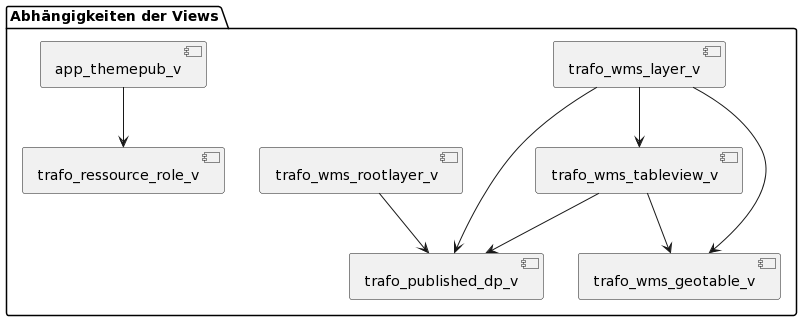

# Views in Simi-DB

In der Simi-DB sind Views für den Export von Metadaten als json (Trafo), die Suche (solr) sowie die Ausgabe / Validierung
von komplexen Zusammenhängen im SIMI selbst (in der Webapplikation).

Das folgende Diagramm dokumentiert die Abhängigkeiten der Views untereinander.



## Aktualisierung aller Views mit einem Command in einer Transaktion

Bei jedem Ausführen der automatischen Migrationsskripte müssen die Views neu erstellt werden, weil die Abhängigkeiten vom Framework mit "cascade" gelöscht werden. Die mit Nummer startenden Skripte werden beim Erzeugen einer leeren Datenbank mittels Gradle-Task createDb ausgeführt, damit die Build-Pipeline bei Schema-Inkonsistenzen mit Fehler abbricht. Die Nummern bestimmen die Ausführungs-Reihenfolge.

Den folgenden Befehl verwenden, um alle Views wieder herzustellen (Nach git repo pull, Host -h und Benutzer -W entsprechend setzen):

```bash
psql -d simi -h localhost -U postgres -W \
  --single-transaction \
\
  -f trafo/drop_trafo_views.sql \
  -f solr/drop_solr_views.sql \
  -f app/drop_app_views.sql \
\
  -f trafo/0_trafo_tableview_attr_with_geo_v.sql \
  -f trafo/0_trafo_published_dp_v.sql \
  -f trafo/0_trafo_resource_role_v.sql \
  -f trafo/0_trafo_wms_geotable_v.sql \
  -f trafo/1_trafo_wms_rootlayer_v.sql \
  -f trafo/1_trafo_wms_tableview_v.sql \
  -f trafo/2_trafo_wms_layer_v.sql \
\
  -f solr/0_solr_layer_base_v.sql \
  -f solr/1_solr_layer_background_v.sql \
  -f solr/1_solr_layer_foreground_v.sql \
\
  -f app/0_app_theme_dprod_v.sql \
  -f app/0_app_themepub_base_v.sql \
  -f app/1_app_themepub_validation_v.sql \
  -f app/1_app_themepub_v.sql \
\
  -f trafo/grant_trafo_views.sql \
  -f solr/grant_solr_views.sql \
  -f app/grant_app_views.sql
```